**RoboSoccer Overview**

Our first robotics project was our RoboSoccer bot.  
It’s not a human like robot playing soccer with robotic legs — it’s a simple RC-controlled, four-wheeled bot (you can think of it as a small car) that pushes the ball toward the goal. Matches are usually 1v1.

---

**The Bot**

Here is our first build. I think it looked pretty good — but unfortunately, it broke during its very first match. :(

  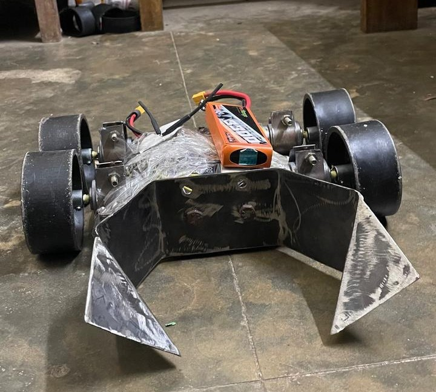
  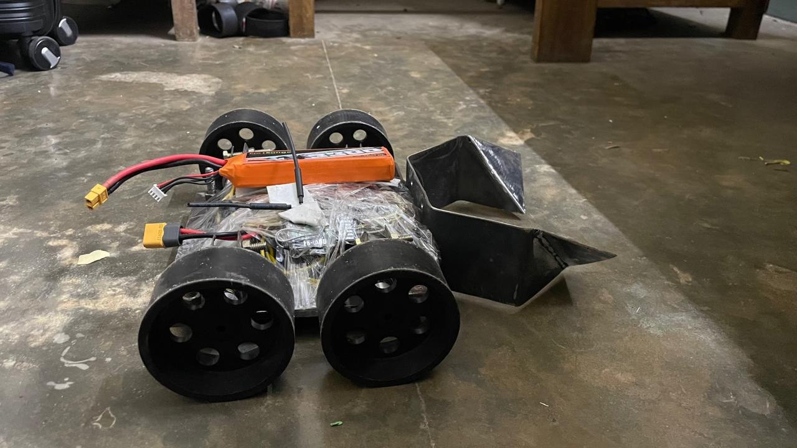
  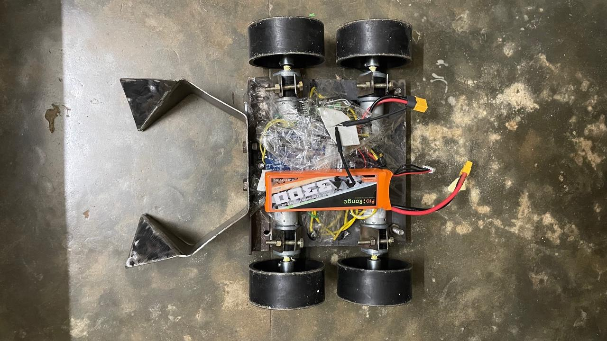
  

Here is our V2. I don’t have a great photo of it, and it doesn’t look better than V1 — but it managed to score a few goals and lasted until the end. It was a good improvement!

  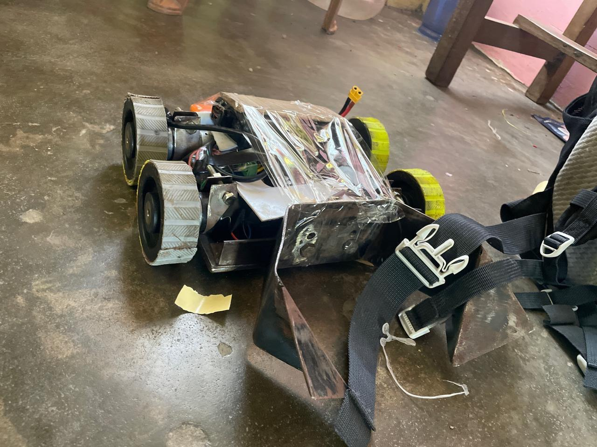
  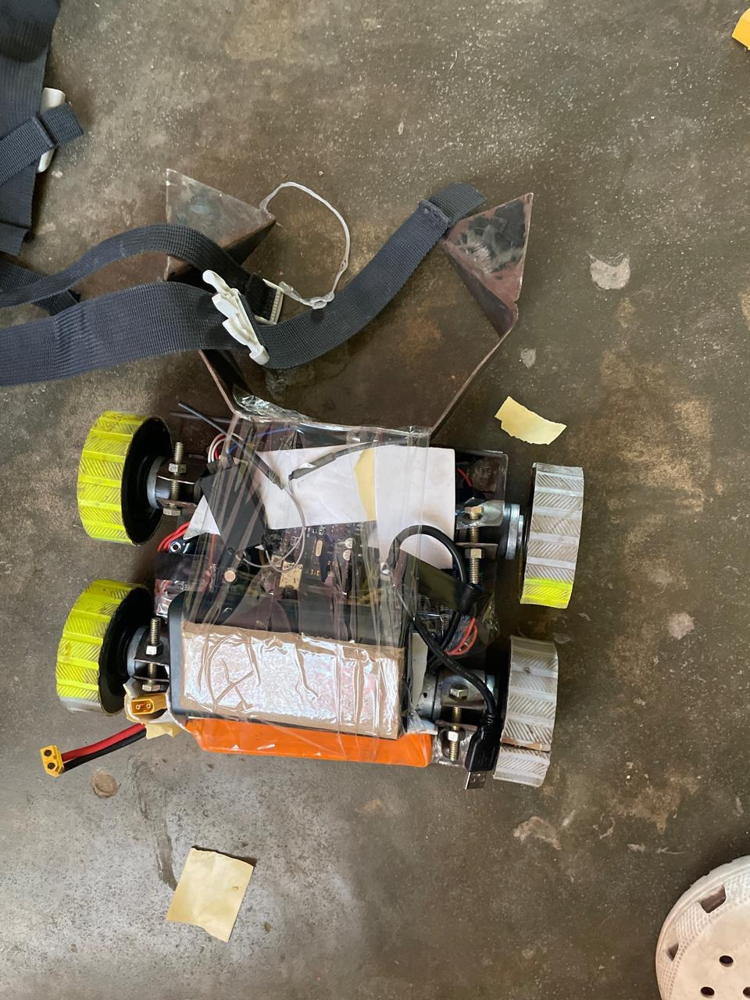

Here are some images of bots from other teams. They are much more advanced and built by teams with way more experience than us.

  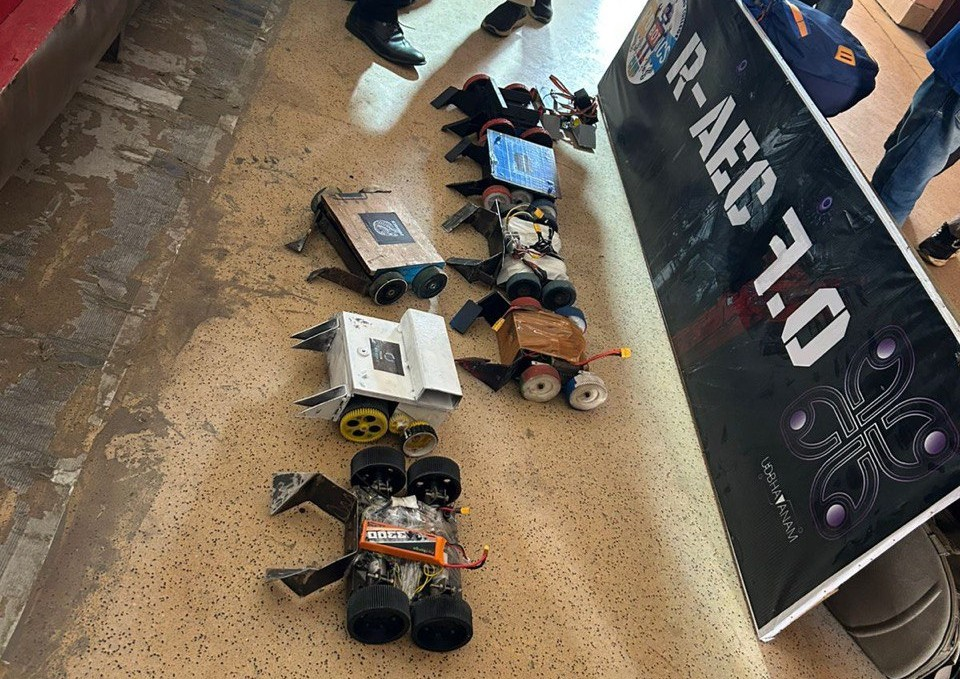

Our v3 bot along with our other it's partner bot won first position in a compeition, Our first win yay.
It was a 2v2 match and all thanks to our other bot which is a beast. Below are some images 

  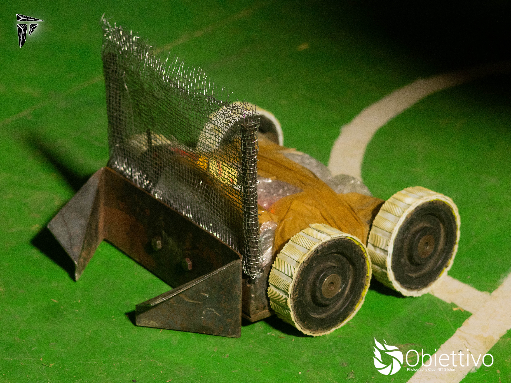
  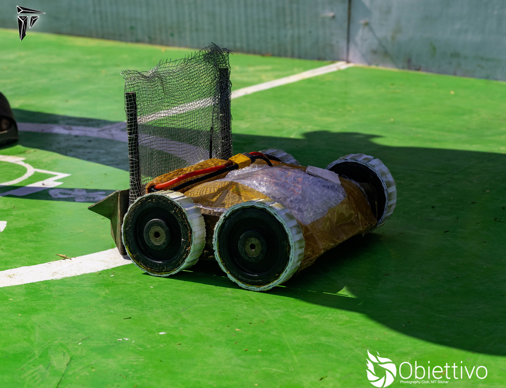
  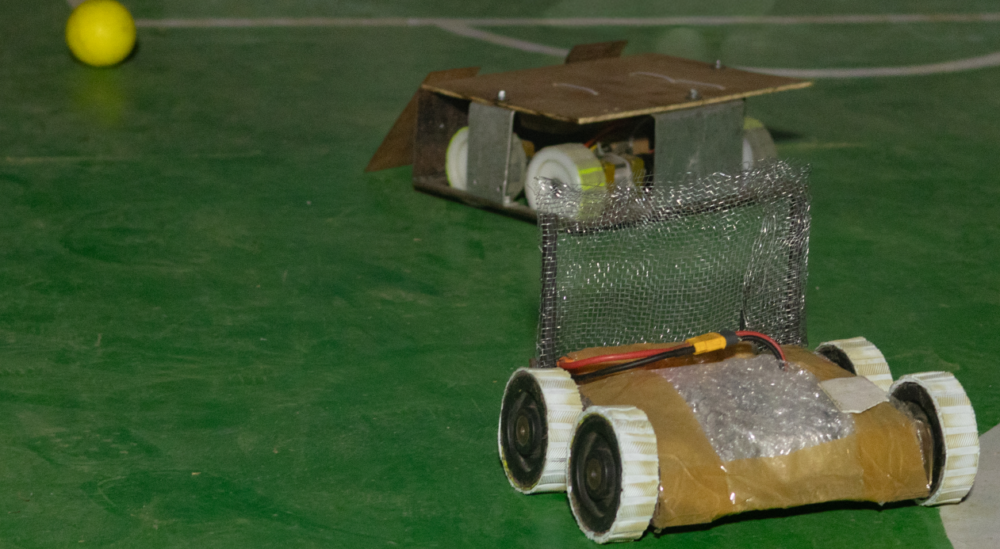
  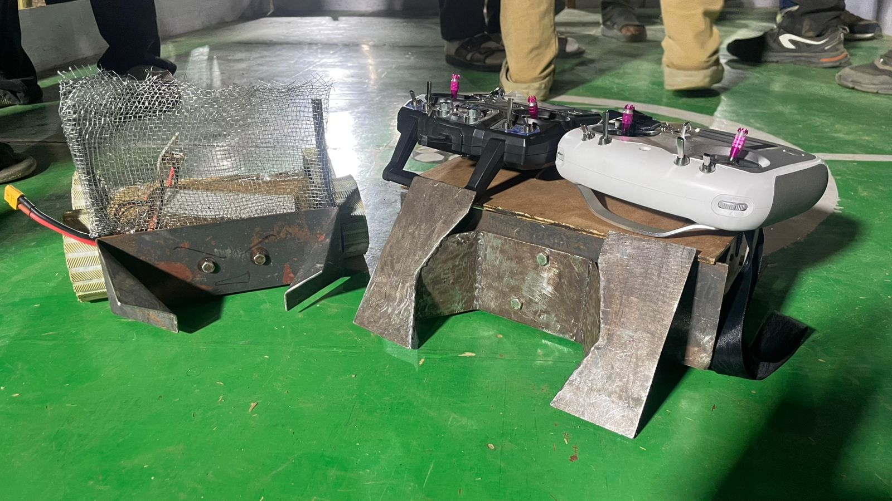

---

**The Arena**

This is what an arena looks like. It’s about 2.5m by 2m in size.

  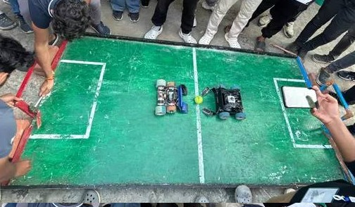

---

**The Game**

The objective of the game is the same as in regular football: score goals. The team that scores the most goals wins the match.

Here is a clip from one of our games. As you can see, it’s more like sumo wrestling than football!

<video controls width="100%" style="max-height: 500px;">
  <source src="robosoccer-jec-game-demo.mp4" type="video/mp4">
  Your browser does not support the video tag.
</video>

Here are links to some games that are much better than ours:

- [Game 1](https://www.youtube.com/watch?v=LaOmCM-d4z0)
- [Game 2](https://www.youtube.com/watch?v=heDUn-9a-r0)
- [Game 3](https://www.youtube.com/watch?v=lur5Ze4Kxl4)

Now let's talk about our robot

## Introduction

Here is a dissection of our bot showing all its key components:

The chassis is built out of mild steel, and the whole bot weighs around 5 kg with the battery included. Most competitions allow a weight limit of 5 kg, but some permit up to 7 kg — in such cases, we can add additional weights.

The key to building a good RoboSoccer bot is ensuring it's sturdy enough to withstand the beating from other heavy bots, while also having enough torque to push opponents. At the same time, it must be agile enough for precise control during fast-paced matches.

---

## Components

### The Motor:

These are the most critical components of the bot, so finding the right motor for our use case was a challenging task — especially since it was our first time working with such motors.

We did a bit of research on different motor types and their specifications. You can find a basic overview of motor fundamentals [here](../common/motors.md).

We eventually chose 12V 300 RPM planetary geared motors called **IG32** from Rhino Motors. These offered the best value and performance in our budget range.

This is an image of the motor we used:

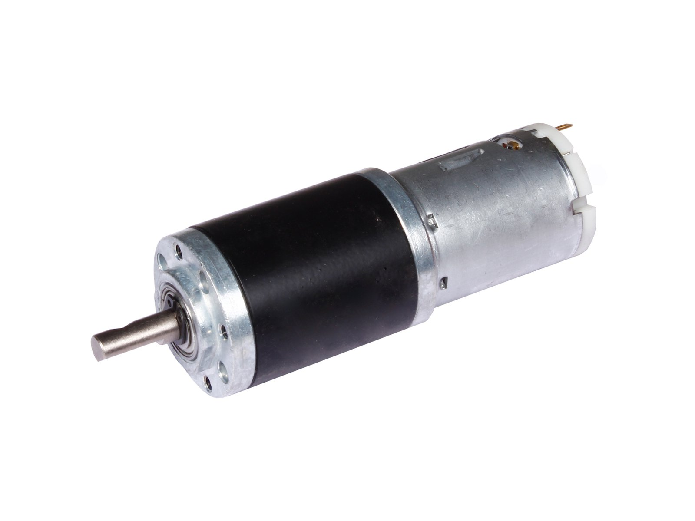

Here are its dimensions:

And below are its detailed specifications:

| **Specification**           | **Details**                                              |
|----------------------------|-----------------------------------------------------------|
| **Type**                   | 12V DC Geared Motor with Metal Planetary Gearbox         |
| **Base Motor RPM**         | 18000 RPM                                                |
| **Output RPM**             | 300 RPM                                                  |
| **Gearbox Stages**         | 3-stage planetary                                        |
| **Rated Torque**           | 10 kg·cm                                                 |
| **Stall Torque**           | > 40 kg·cm (use at rated torque for longevity)           |
| **Shaft Type**             | D-type                                                   |
| **Shaft Diameter**         | 6 mm                                                     |
| **Shaft Length**           | 16 mm total (12 mm D-shaped)                             |
| **Shaft Thread**           | M3 threaded hole                                         |
| **Back Shaft Length**      | 9 mm                                                     |
| **Gearbox Diameter**       | 32 mm                                                    |
| **Motor Diameter**         | 28.5 mm                                                  |
| **Motor Length**           | 70 mm (without shaft)                                    |
| **Weight**                 | 300 g                                                    |
| **Supply Voltage**         | 12V DC                                                   |
| **No-load Current**        | 800 mA                                                   |
| **Load Current (Max)**     | Up to 7.5 A                                              |
| **Coupling Options**       | CNC coupling (6 mm) or fixed coupling                    |

You can buy these motors [here](https://robokits.co.in/motors/rhino-ig32-12v-20w-dc-motors/dc-geared-12v-motor/rhino-12v-dc-300rpm-10kgcm-ig32-heavy-duty-planetary-geared-motor?srsltid=AfmBOoqVHB813jvnOhRy1lyMDQRM1ZH16Mm-hzgd4kq7T1jpzu9Uoq_w)