## UBUNTU INSTALLATION (DUAL BOOT)

Switching to Linux was one of the best choices i made both for myself and for my computer. If you are not a proffesional user of abdobe products or a hardcore gamer you can and should switch to Linux. I distro hopped many times and made my peace with Ubuntu with KDE. And i truly love my setup, Its efficient It's clean It is the way i want it to be.

This blog will guide you for a dual boot install of Ubuntu that is you will have your Windows system intact and will be able to choose between Windows and Ubuntu while turning on your computer. This is a good way for beginners to try ubuntu first and than you can remove the windows components later.

Two things you will need :

- A empty pendrive with minimum 8gb space
- Minimum 50gb free space on your computer

## 1. Unallocate some free space for your new Operating system

> It is recommended to back up any data since this step may clear up your drive if not done carefully

- Press **Win + X** and click on **Disk management**
    

    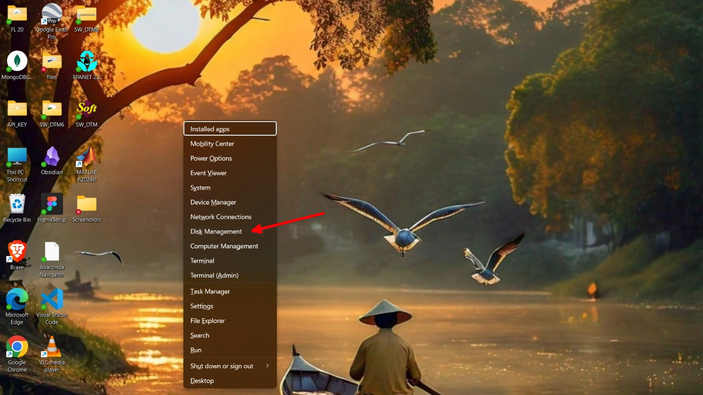
    

- You will see all the partitions of your drive , right click on the drive which you want to shrink to free up some space and click on **Shrink Volume**
    

    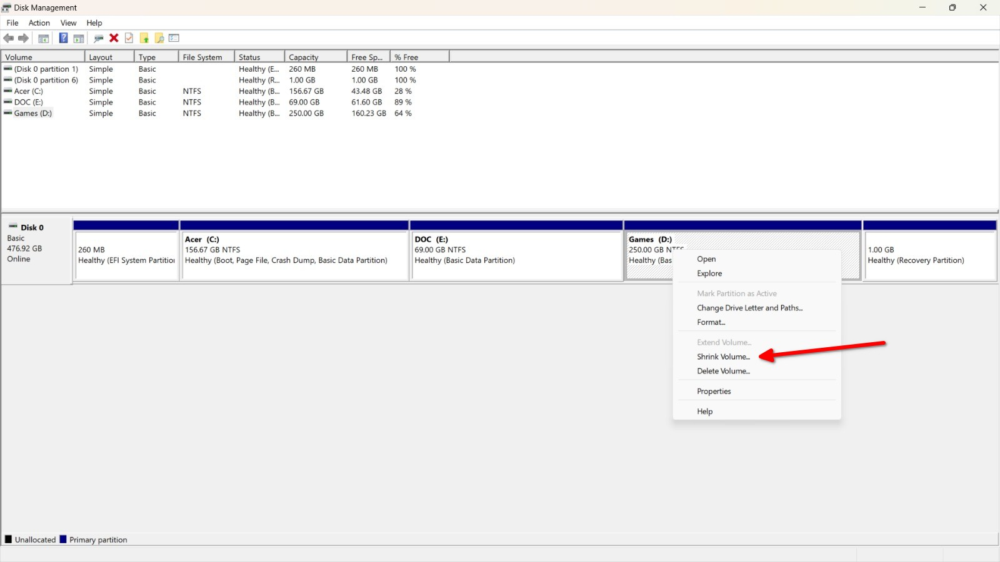
    

- Enter the amount of space you want to free for your new OS. I  
    am going for 80gb , A minimum of 50gb is recommended

    

    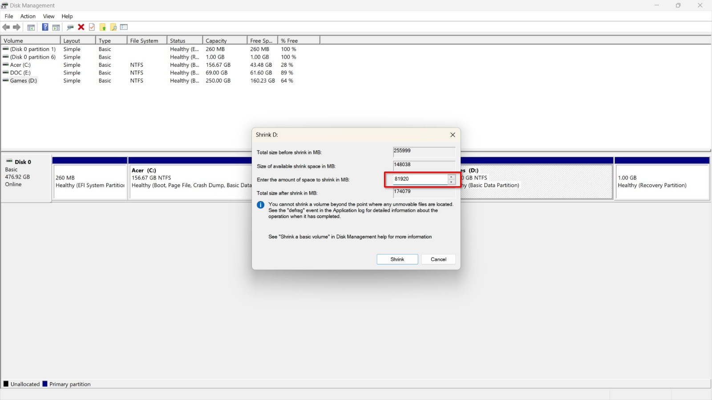
    

- After some time the unallocated space will be created where we will install our Ubuntu

    

    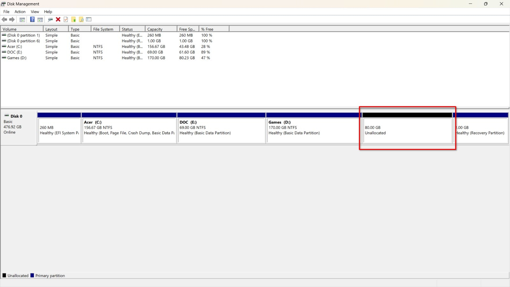
    

## 2. Create a bootable USB drive ( the installer )

- Download and install **balena etcher** from [here](https://etcher.balena.io/#download-etcher) and insert your USB drive.  

- Download the **Ubuntu 22.04 ISO** image from [here](https://releases.ubuntu.com/jammy/ubuntu-22.04.5-desktop-amd64.iso)  

- Open balena etcher  
    

    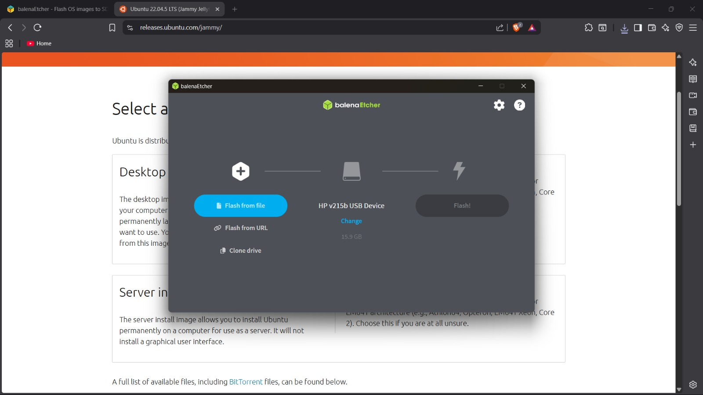
    

- Click on **Flash from file** and select the Ubuntu ISO you have downloaded
    

    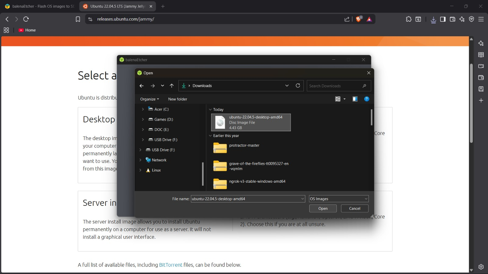
    

- Select your USB drive / it was automatically detected in my case
    

    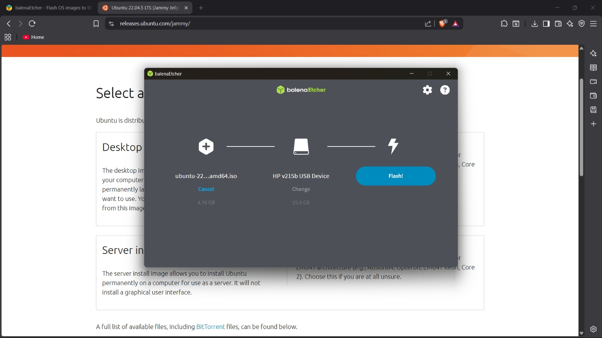
    

- Click on **flash** , It will take some time to complete.
    

    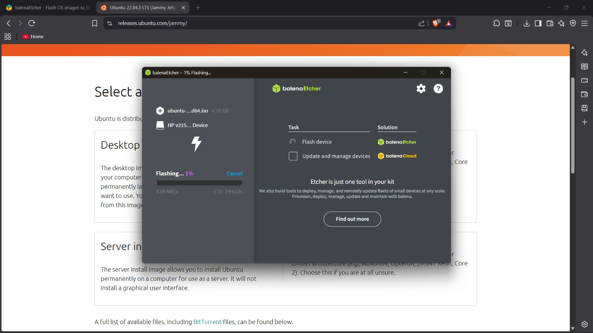
    

## 3. Installing the system

> Depending upon your computer you may need to go into BIOS and turn off Secure boot and enable boot menu  

- Shutdown your computer  

- Turn on your computer by continuously pressing the key corresponding to your computer brand.

  - Dell : F12  
  - HP : Esc, then F9  
  - Lenovo : F12 or Fn + F12  
  - ASUS : Esc  
  - Acer : F12  
  - MSI : F11  
  - Samsung : Esc or F12  

- The boot menu will open , Select the option like below, Your's may be different just select the one without the name Windows.
    

    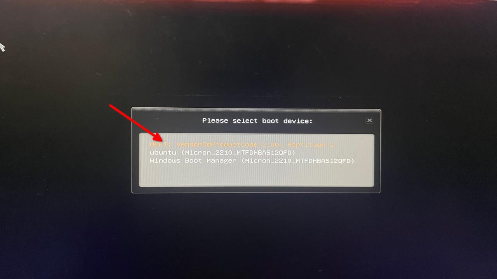
    

- You will be in the gnu boot menu now , Select **Try or Install Ubuntu**
    

    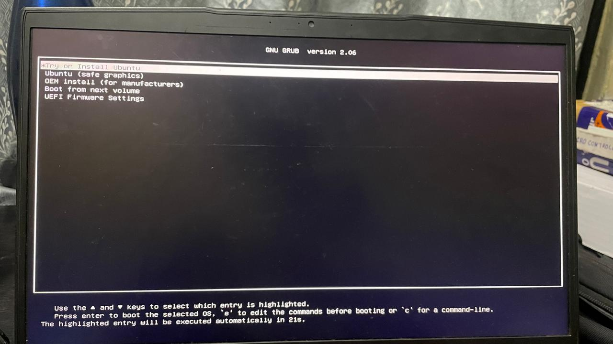
    

- Click the **Install Ubuntu** option and follow along with the default options
    

    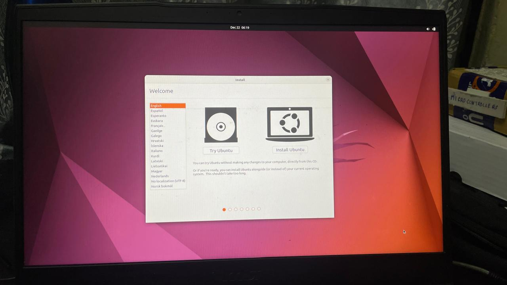
    

    

    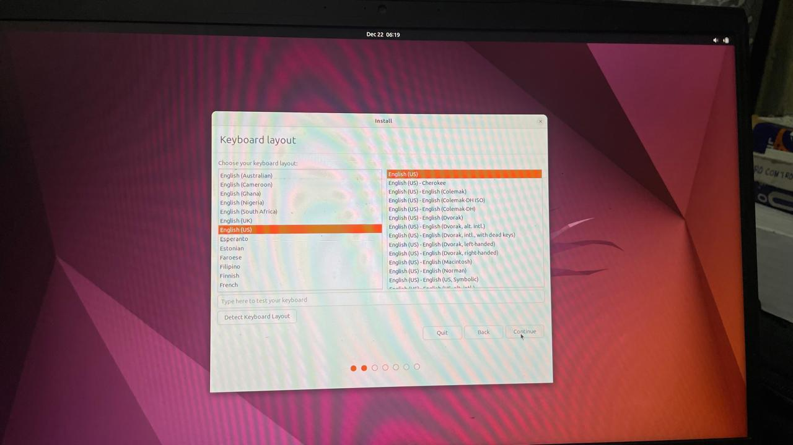
    

- Select the options like below

    

    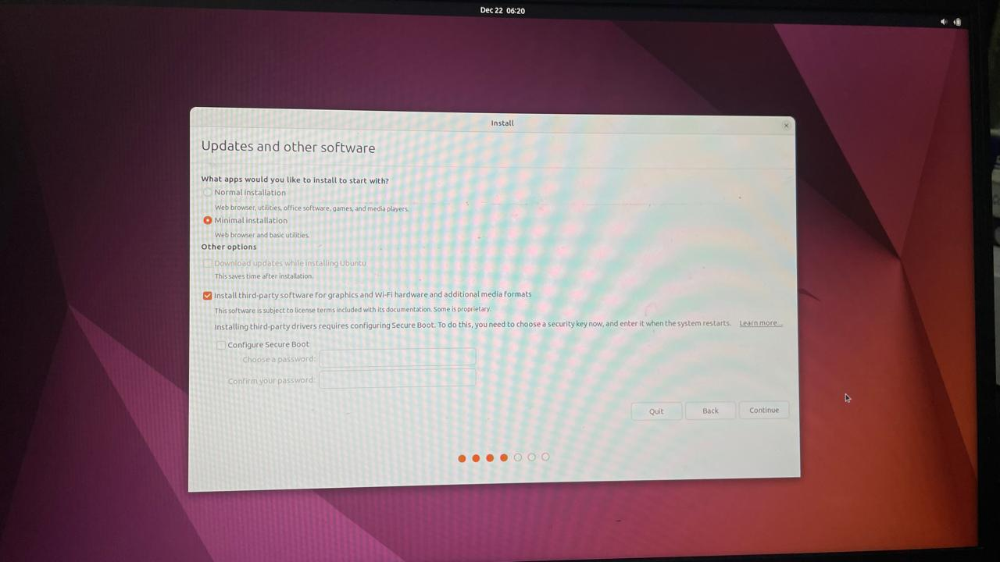
    

- Select **Install alongside windows** (This step is very important)
    

    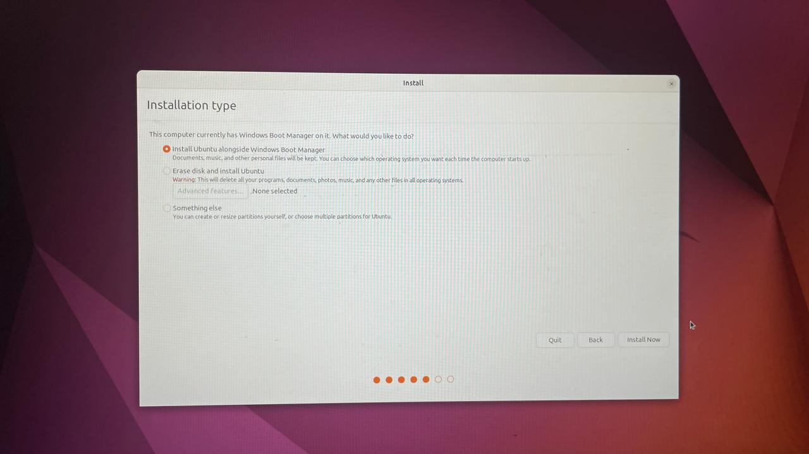
    

- Follow along with the default settings , then this page will be shown , This may take some time.
    

    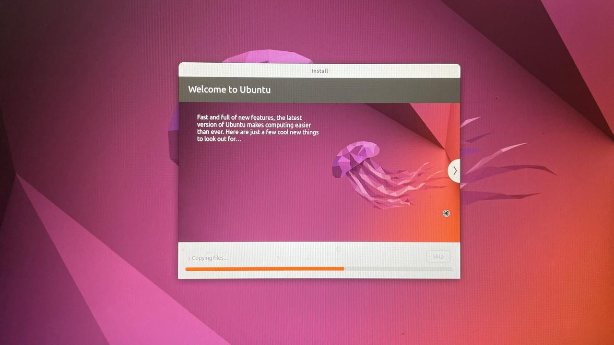
    

- Click **Restart now**
    

    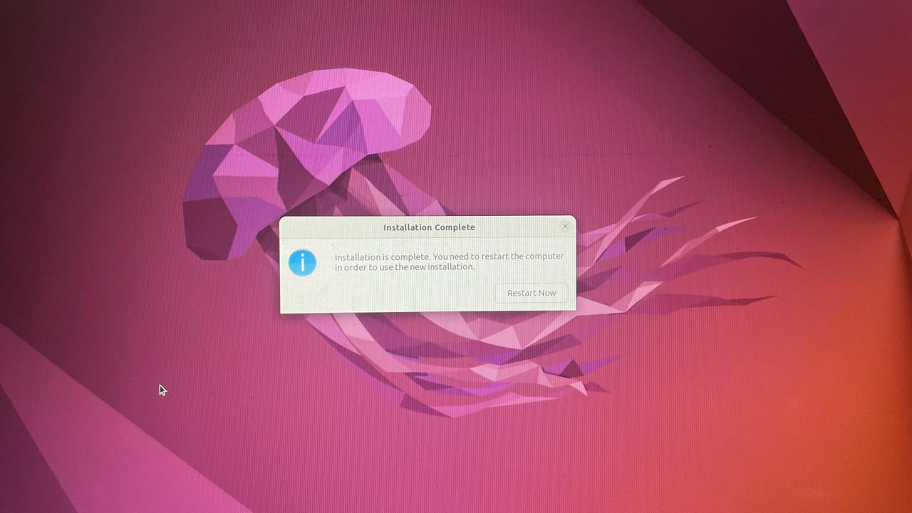
    

- Remove your USB drive and then press **Enter**
    

    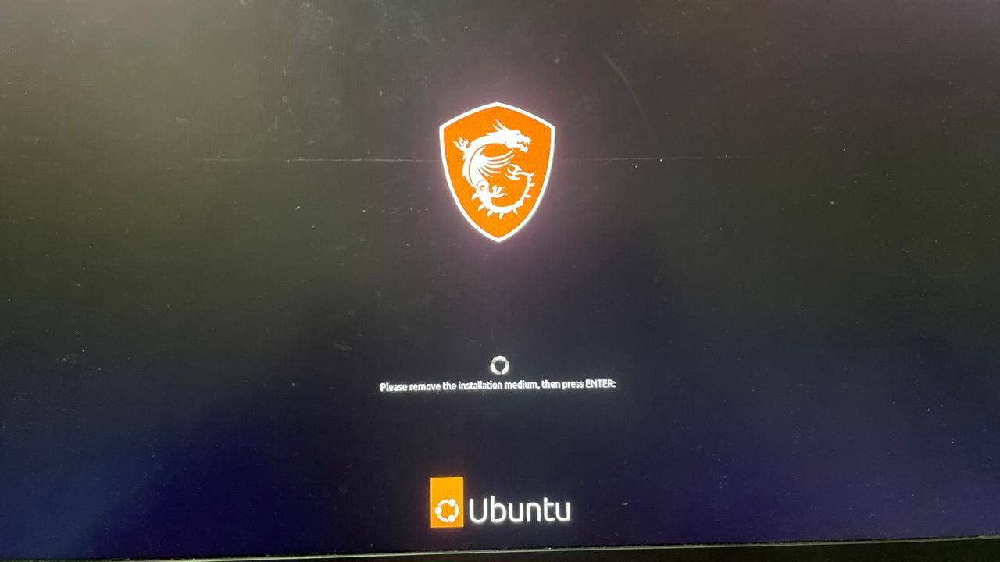
    

- After the Restart , You will see a boot menu like below. Select **Ubuntu** and you will logged into your New Ubuntu Installation
    

    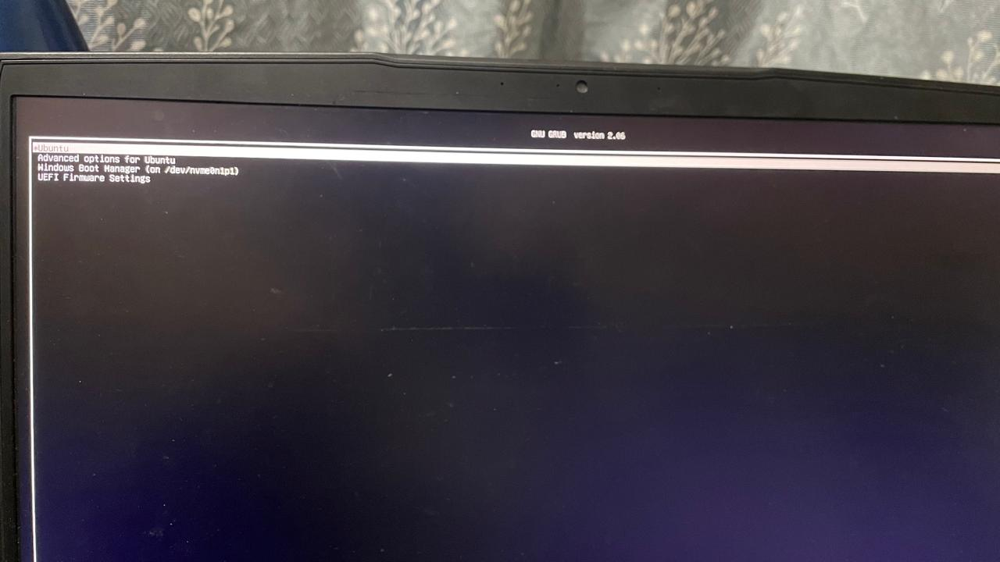
    

That was it , Welcome to the world of Free Open and Cool Software where you control what you use not the other way around.
