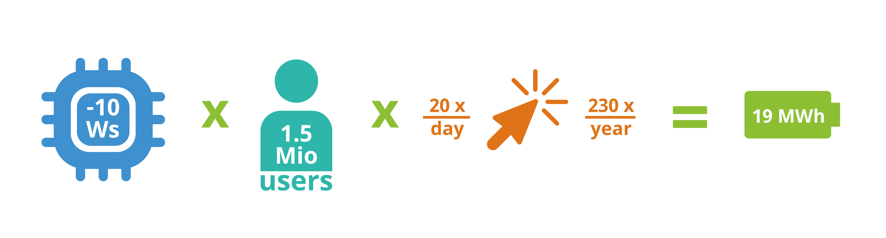

  

> Image credit : [Lacaster](https://krita-artists.org/u/lacaster/) from Krita artists community

When we think about things that impact our environment badly , materilistic products like cars, plastic comes to our mind. But software products can also leave a environmental footprint. This effect is mostly not discussed and does not catch our eye easily but on a larger scale they does have a huge environmental impact.

I recently bumped into a very interesting project run by a bunch of very kool and friendly people at KDE named as [KDE Eco](https://eco.kde.org/) project which aims to promote use of Free, Open Source and Sustainable software. You may think what does the apps you use has to do with environment and Sustaiability right ?

The apps you use takes up electricity. Properitary software often collects data, contains ads and uses hardware inefficiently which shortens the lifespan of your device. As a result you will need to buy a new computer or phone more frequently and your old device becomes e waste.

Now lets talk about how and why Free and Open Source software are more effiencient and does less harm. Lets take some examples
1. Windows tends to use almost 3 to 4gb RAM in idle mode due to lot's of running background processes that cannot be stopped , compared to Kubuntu which uses it's half. This leads to difference in power consumption as well as performace of your system.
2. Microsoft officially ended mainstream support for Windows 10 on October 14, 2025, meaning it no longer receives security updates, bug fixes, or technical assistance from Microsoft. That means millions of computers in companies using old hardware will most likely become e waste
3. The development of open source projects is done not with the plan to maximize profit by a few individuals but by community as a whole that leads to healthy and fair decisions.
4.  The last point i will highlight is that you can see the codebase of open source projects, modify it if you want to and switch to a different version, build it to support on your old phone or computer.

You may still think that the effect by software is still very small compared to other industries like automotive, clothing etc. So we should focus on those rather than this small sector.But at scale, small decisions can translate into massive energy savings. The below image shows how this scales up .

> Image source : Kde eco [handbook](https://eco.kde.org/handbook/)

 For reference 19MWh can roughly power about 10 homes for an entire year.

If you are convinced by my words above that's very good welcome to the world of Free, Kool, Open, and Sustanaible software , If not let me explain to you about a project developed by some really kool people from the KDE Community and I am fortunate enough to work with them starting this January as part of Season of KDE.

[KEcoLab](https://invent.kde.org/sdk/kecolab) is a lab located in Berlin that you can access remotely via GitLab. It allows you to measure the energy usage of software using a CI/CD pipeline and some scripting. Yes you can actually measure and analyze how much energy the software you use consumes. The current measurements of lab is currently under development due to some recent changes, and I’m working on getting the existing measurement scripts running again. Sounds kool, right?

In the near future,i hope to see the lab be able to measure almost any software. And since this is an open source project, you can help with that too, The people working on it are incredibly friendly and welcoming.

This is a very very informal and personal blog to kick off my season of kde work, Thanks for reading.
