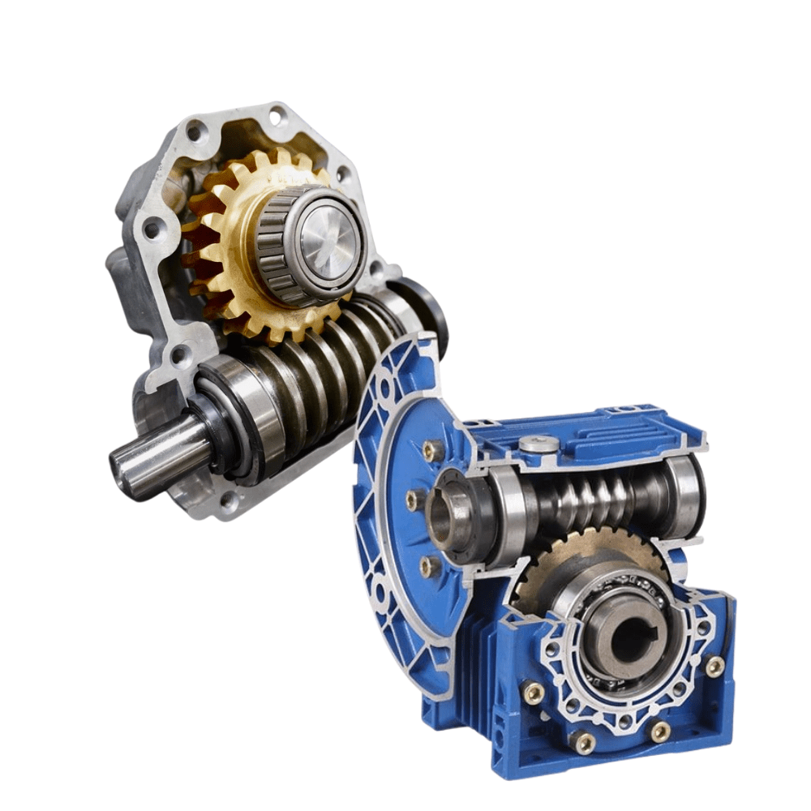

# Motors 101

Understanding motors was one of the first things we had to get comfortable with while building our RoboSoccer bot.  
We knew we needed torque — but what does that actually mean? How do you choose the right motor? What’s the deal with all the gears?

This page breaks it down simply.

---

## **Torque and Speed**

For our use ,the two things that mattered the most were : **torque** and **speed (RPM)**.

- **Torque** is the twisting force a motor can apply. Think of it as how hard the motor can push or pull.
- **RPM (Revolutions Per Minute)** is how fast the motor spins.

These two are inversely proprtional , higher speed usually means lower torque and vice versa. That’s why we use gears (more on that later).

Pushing the ball it a lot more easier than pushing another robot therefore torque is more important than speed. Our bot doesn’t need to zoom across the arena since its a small one — it needs to push hard and hold its ground.

---

## **Types of Motors We Explored**

### **DC Geared Motors**

- Simple brushed DC motors with a gear system attached
- Easy to use and control
- Available in many RPM and torque options

### **Brushless Motors (BLDC)**

- Super fast and efficient
- Used in drones and high-speed robots
- Require advanced drivers and control logic (ESCs)

---

## **What Are Gears Doing in a Motor?**

If you've seen a motor with a big metal can at the front, that's usually the **gearbox**.

Gears allow us to **reduce speed and increase torque**. The motor itself spins fast but doesn’t have much force. Adding gears reduces the RPM but massively increases the torque.

Without gears, the motor would just spin fast and stall the moment it touched the ground or a ball.

---

## **Types of Gear Systems**

### **1. Spur Gearbox**

- Simple gear system
- Gears are in a line
- Cheaper but not very compact
- Moderate torque

### **2. Worm Gearbox**

- Good torque
- Self-locking (doesn’t rotate backward)
- Less efficient and bulky

### **3. Planetary Gearbox (our choice)**

- Compact and powerful
- High torque with small size
- Gears rotate around a central gear like planets — hence the name
- Slightly more expensive, but worth it for performance

---

## **Choosing the Right Motor**

Some rules of thumb we followed:

- Look for **torque first**, especially if you’re pushing something
- Pick **RPM depending on arena size** (too fast = hard to control)
- Prefer **metal gear motors** over plastic ones
- Go with **planetary geared motors** if budget allows

In our case, we chose **12V 300 RPM IG32 motors with a planetary gearbox** — great torque, sturdy, and within budget.

---

## **More to Learn**

We’re still learning about motors, drivers, and control systems. In the future, we’d like to try:
- Encoders for measuring speed and distance
- Brushless motors with smart ESCs
- Autonomous control with PID or closed-loop feedback

---

That’s it for motors! Hope this helps if you're starting out.

