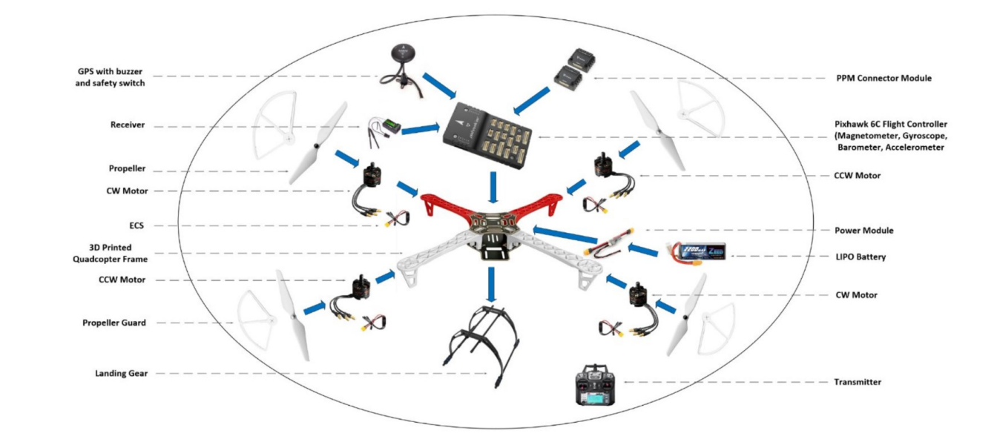

# Anatomy of a Quadcopter

A Quadcopter is build out of various mechanical and electrical components , that works together to make it fly. These components can be of various types or specifications which you may select , below are all the basic components of a quadcopter.

