# Overview

## **Introduction**

A drone is a unmanned aerial vechicle (UAV) , a vechicle that flies and has no humans in it , you can say it as a remote controlled plane in simple terms 

These are the most common types of drones we normally use :

> *Image source: [An Overview of Drone Applications in the Construction Industry](https://www.mdpi.com/2504-446X/7/8/515)*

All of these are just different types of designs used for different purposes , their main goal is to fly.

## **Quadcopters**

Quadcopter is a type of drone and as its name suggests it uses quad(four) rotors (or motors) to fly . These spinning propellers let the quadcopter fly, hover, turn, and move in any direction. 

Quadcopters come in various types, distinguished mainly by their frame shapes and intended uses, here are the different types of frame shapes :

  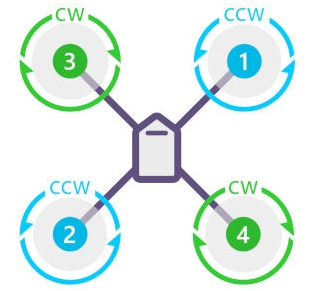
  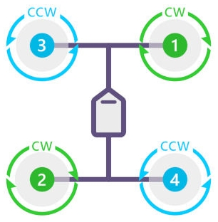
  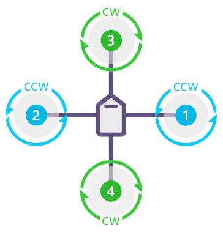

  
  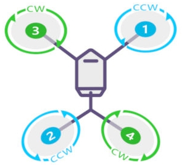
  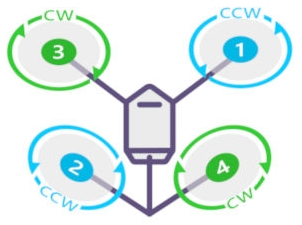

> *Image source: [Quadcopter Drones: A Comprehensive Beginner’s Guide](https://www.t-drones.com/blog/quadcopter-drones.html)*

The most common quadcopter that you may have seen or used are DJI drones :
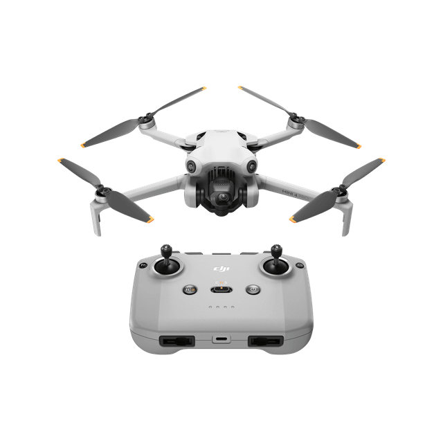

> *Image source: [DJI Mini 3](https://store.dji.com/product/dji-mini-3?vid=128001)*

And this is what our quadcopter looks like

## How does a Quadcopter Fly

Newton’s Third Law says:

*“For every action, there is an equal and opposite reaction.”*

This means that whenever one object pushes on another, the second object pushes back with the same force, but in the opposite direction.

When a quadcopter’s propellers spin, they push air downward. Using Newton’s third law, this represents the action. For Newton’s law to be true, there must be an equal and opposite reaction. This reaction is an upward force pushing on the quadcopter. Once this force exceeds the force of gravity pulling the quadcopter downward, the quadcopte begins to move up. 

  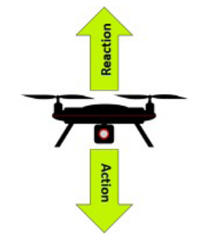

> *Image source: [NASA](https://www.nasa.gov/wp-content/uploads/2020/05/aam-science-behind-quadcopters-reader-student-guide_0.pdf)*

Well this is only up and down motion , but a quadcopter can turn and move in any direction and can do flips also , how does it do that ?

#### **Movements of a Quadcopter**

The three fundamental movements are up & down (vertical movement) , left & right and front & back(lateral movement) and round and round (rotational movement)

  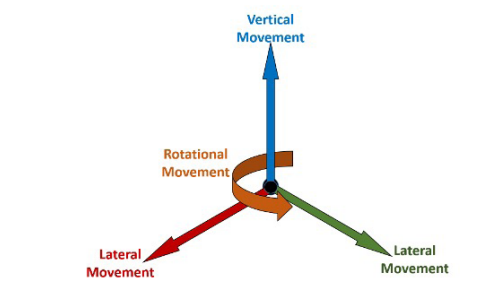

> *Image source: [NASA](https://www.nasa.gov/wp-content/uploads/2020/05/aam-science-behind-quadcopters-reader-student-guide_0.pdf)*

All of these movements can be achieved by varying the speed of the 4 rotors in different ways.

When the propellers spin, they push air down. Similar to a helicopter, pushing the air down is the action in Newton’s third law of motion. The reaction is a force, called
**lift**, which pushes the quadcopter up. Each of the propellers will create lift, and the total lift for the quadcopter will be the sum of the four propellers’ lifts. The total force of the lift must be stronger than the force of gravity for the quadcopter to take off. Once in the air, the quadcopter can hover with no vertical movement by having the forces of lift and gravity equal.

  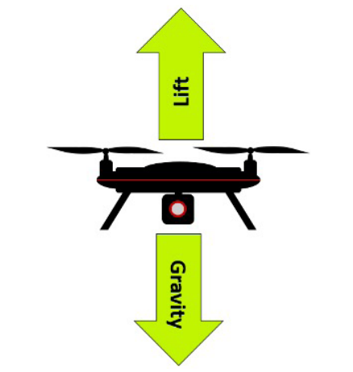

> *Image source: [NASA](https://www.nasa.gov/wp-content/uploads/2020/05/aam-science-behind-quadcopters-reader-student-guide_0.pdf)*

When the force of lift acts straight upward, the quadcopter moves vertically. But, when lift acts at an angle, it can also move laterally. This is because part of the force of the lift is upward and part of it is to the side, resulting in lateral movement that can be from side-to-side or forward and backward. 

  

> *Image source: [NASA](https://www.nasa.gov/wp-content/uploads/2020/05/aam-science-behind-quadcopters-reader-student-guide_0.pdf)*

Lateral movement occurs by varying the speed of the propellers. Increasing the speed of the two propellers on one side of the quadcopter and/or decreasing the speed of the two propellers on the other side creates uneven amounts of lift on the two sides. The lift created on the side with the faster spinning propellers is greater than the lift created on the opposite side. The result is that the quadcopter moves in the direction of the side where less lift is created.

Here are all the movements using lateral movement :

  

  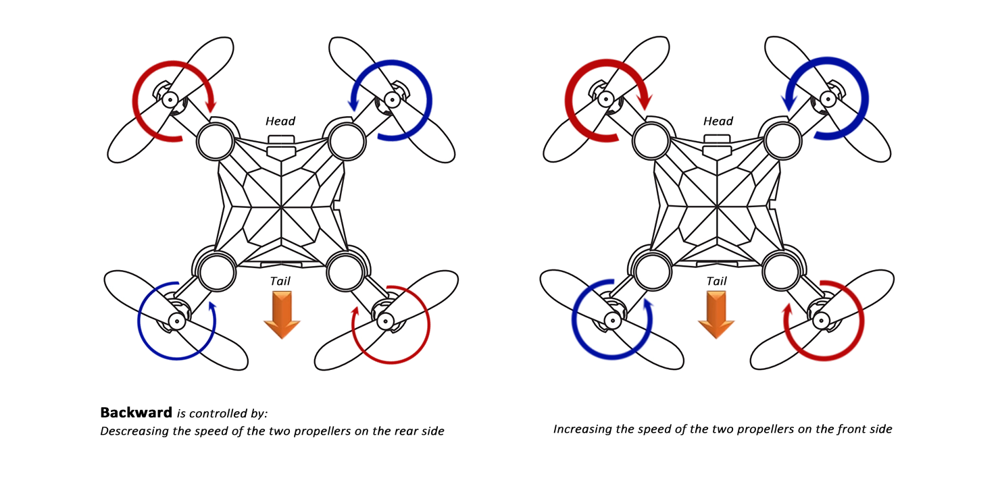

  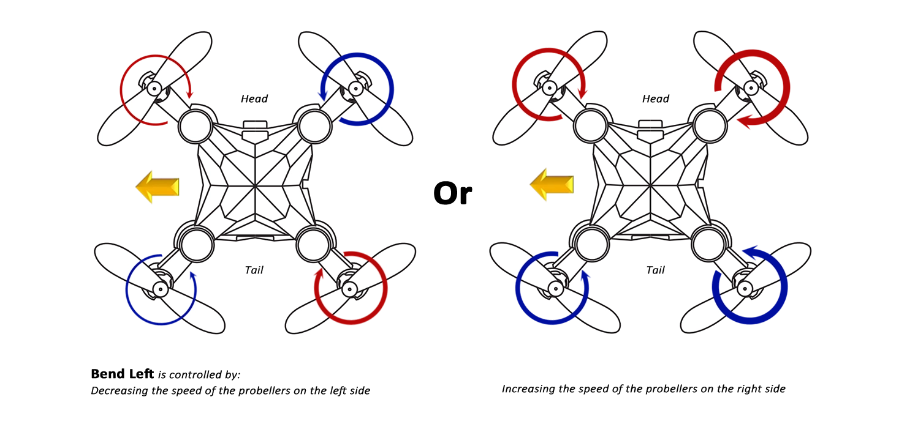

  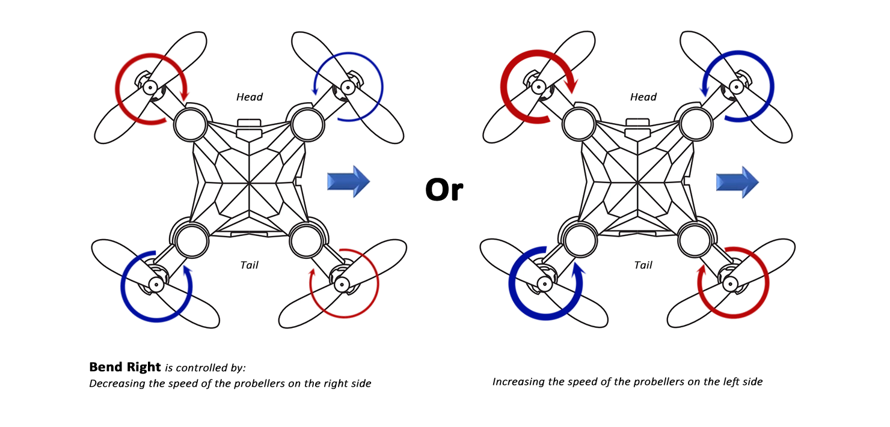

> *Image source: [Mastering the Art of Drone Maneuvers: Exploring Lateral Movements and Rotations](https://www.holystone.com/en/blog/FlyingFun/DroneManeuvers.html?srsltid=AfmBOoqNSvzxwp2rUDrEzNYTp0H40K7R8PqHS1ID9_oTDKWuo5J6_YXg)*

And the last type of movement is rotational motion , how does the quadcopter rotates in its own axis ? for that lets learn about the oreantations of the rotors of a quadcopter.

  

> *Image Source: [Ardupilot]()*

As you can see in the above image , Rotor 3 and 4 rotates in Clockwise direction and Rotor 1 and 2 rotates in Anticlockwise direction.

This is done due to a force called torque , a twisting force that causes rotation When a propeller spins, this force is produced. And, according to Newton’s third law of motion, an equal and opposite force is produced as well.

  

> Image Source: [Air transportation safety investigation report A20A0027](https://www.tsb.gc.ca/eng/rapports-reports/aviation/2020/a20a0027/a20a0027.html)

We see this in action when we look at a helicopter like the one above. When the blades on top of the helicopter (the rotor) spin, torque is created. The equal and opposite force rotates the body of the helicopter in the opposite direction of the blades’ rotation. Since this would make the helicopter unusable, a tail rotor is added. It
creates a force that counteracts the torque and stops the helicopter from rotating uncontrollably

Torque also affects a quadcopter when its propellers spin because each propeller individually creates torque when it rotates. All four torques are added up to determine 
the total torque acting on the quadcopter, If all propellers spins in same direction , the quadcopter body would have been rotating in the opposite direction .Therefore  
Engineers have come up with a clever way of counteracting this torque—two of the propellers spin clockwise and two spin counterclockwise,. This results in two
propellers creating torque that acts clockwise and two creating torque that acts counterclockwise. Thus, the forces cancel each other out.

This torque can also be used to create rotational movement for the quadcopter.In the above shown image When propellers 1 and 3 rotate, they produce counterclockwise torque(remember, equal and opposite reactions). If these propellers rotate faster than propellers 2 and 4, the counterclockwise torque acting on the quadcopter will be 
stronger than the clockwise torque acting on it. This results in the quadcopter rotating counterclockwise. Of course, if propellers 2 and 4 rotate faster than 
propellers 1 and 3, the quadcopter will rotate clockwise.

  

  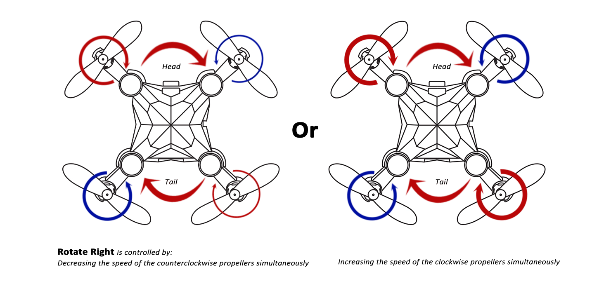

> *Image source: [Mastering the Art of Drone Maneuvers: Exploring Lateral Movements and Rotations](https://www.holystone.com/en/blog/FlyingFun/DroneManeuvers.html?srsltid=AfmBOoqNSvzxwp2rUDrEzNYTp0H40K7R8PqHS1ID9_oTDKWuo5J6_YXg)*

### **The Propellers**

While having pairs of propellers rotating in opposite directions effectively controls the torque acting on the quadcopter, it presents a new problem for us. If propellers spin in opposite directions, two of the propellers push air upward while two push air downward. When you combine these forces, the total lift is zero and the quadcopter
cannot take off. To overcome this, we use two different propeller blades.

  

> *Image Source: [Ardupilot]()*

In above image, you can see that the leftmost propeller has the right edge higher in the front while the other has the left edge higher. This design changes the direction the air is pushed by the two propellers, meaning that when they spin in opposite directions, they actually push the air in the same direction.

This was a brief overview of what quadcopters are and how does they work.

## References

1. The Science behind quadcopters - [NASA](https://www.nasa.gov/wp-content/uploads/2020/05/aam-science-behind-quadcopters-reader-student-guide_0.pdf)
2. Quadcopter classification - [T-drones](https://www.t-drones.com/blog/quadcopter-drones.html)
3. Quadcopter Movements - [Holystone](https://www.holystone.com/en/blog/FlyingFun/DroneManeuvers.html?srsltid=AfmBOoqNSvzxwp2rUDrEzNYTp0H40K7R8PqHS1ID9_oTDKWuo5J6_YXg)
4. [Wikipedia](https://en.wikipedia.org/wiki/Quadcopter)
