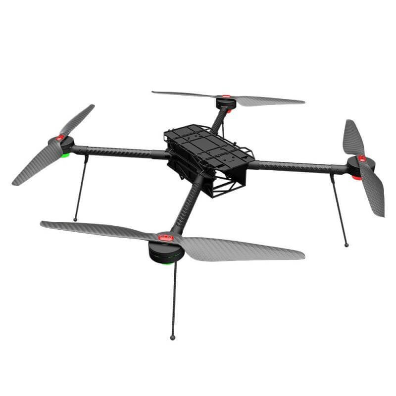
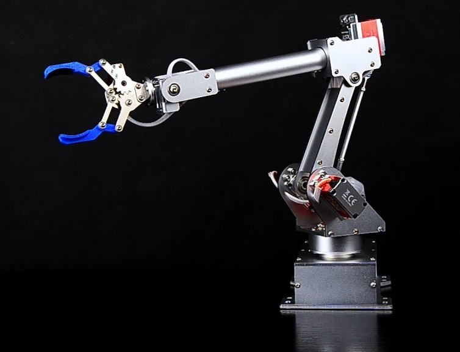
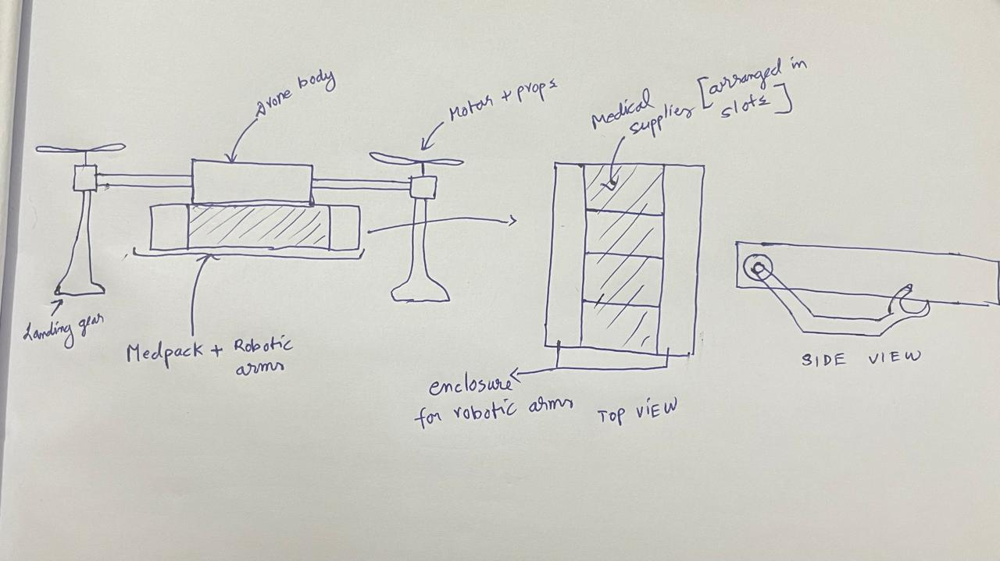
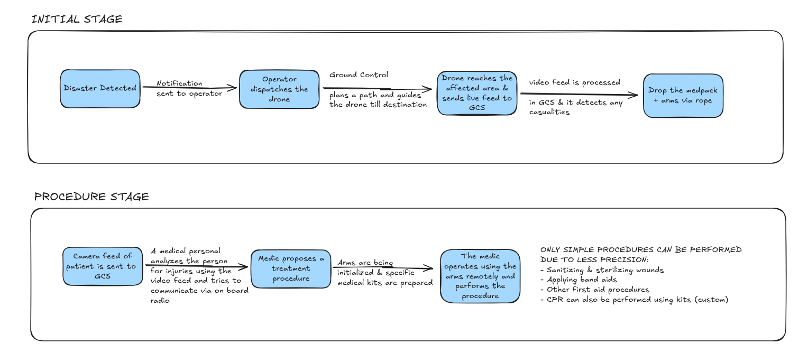

# Medicopter

*The name is not finalized yet so I used Medicopter for now*

Building a drone is no good without a meaningful purpose. Our goal is to develop a drone that provides first aid treatment during disasters such as earthquakes, floods, and similar emergencies (a disaster response drone). In the long term, I plan to extend its use for first aid delivery in remote areas that are inaccessible by road, where helicopters are too expensive and not as environmentally friendly as drones — for example, remote mountain colonies.

The most common causes of death during disasters are:

DIRECT CAUSES:

- Drowning in case of floods
- Building collapse in case of earthquakes

INDIRECT CAUSES:

- Bleeding from injuries
- Lack of access to medications & treatment
- Infections
- Fatal injuries

And many more…

The direct causes often cannot be avoided or treated by medical means. However, the indirect causes of death can be prevented if casualties receive timely treatment. Unfortunately, in disaster-hit areas, roads are often blocked, and in hilly or remote regions, reaching victims can take a long time.

### Our Solution

Therefore, I propose a medical drone equipped with two teleoperated robotic arms along with a med-pack containing basic first aid supplies. Using the arms, simple first aid procedures such as sterilizing and bandaging wounds can be performed.

It may be undrstood more easily if shown visually:

Below are images of a quadcopter drone and a robotic arm:

  
  

I want to combine these two and create something as shown below:

*excuse my artistic talent*

It may seem like a sci-fi movie but below is a youtube video of such teleoperated arms which works with very precision that can i think perform small medical tasks:

<video controls width="100%" style="max-height: 500px;">
  <source src="../assets/videos/7bot-arm.mp4" type="video/mp4">
  Your browser does not support the video tag.
</video>

It was done 10years ago so i belive we can make a better one :)

Drones have clear advantages:

- Fast response time
- Increasingly advanced with the development of AI
- Zero carbon emissions (electric-powered)
- Less costly than helicopters

More about drones can be found [here](./index.md)

Robotic arms are also becoming more advanced every day, and when teleoperated, they allow a trained medical professional to perform procedures remotely.

### The Workflow

more procedures can be done like:

- zip stiches
- injection (advanced)