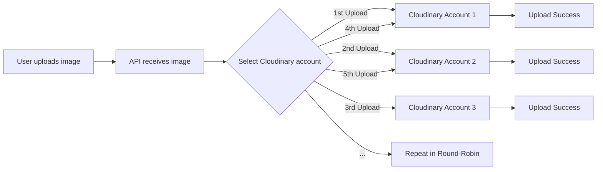

# Freemium Hacking: Rotating Cloud Storage Accounts for Educational Purposes

Recently, while I was building a project, I needed a cloud storage provider to store images, videos, etc. — basically a SaaS product. I had a ₹0 budget for the project, so I needed a service with a free tier. Luckily, there are lots of them out there...

*Here is a comparison of various providers*

| Provider          | Free Storage     | Free Bandwidth        | File Size Limit             | Notable Limits / Notes                    |
|------------------|------------------|------------------------|-----------------------------|--------------------------------------------|
| **Amazon S3**     | 5 GB             | 15 GB/month            | 5 GB                        | 20,000 GET & 2,000 PUT requests/month      |
| **Cloudinary**    | 25 Credits/month | 25 GB bandwidth/month  | 100 MB (images, videos)     | 25 GB total storage included               |
| **Firebase Storage** | 1 GB         | 5 GB/month             | 2 GB                        | 50K read, 20K write operations/day         |
| **Supabase**      | 1 GB             | 2 GB/month             | ~50 MB (browser upload)     | File size capped by browser or CDN         |
| **ImageKit**      | 20 GB            | 20 GB/month            | 25 MB (browser), 100 MB (API) | 500 transformations/day limit            |
| **Uploadcare**    | 1.5 GB           | 1 GB/month             | 100 MB                      | 300 file uploads/month                    |
| **Backblaze B2**  | 10 GB            | 1 GB/day download      | No hard limit               | 2,500 downloads/day                       |

I decided to use Cloudinary for my project because it offered a decent free tier with generous bandwidth and transformation limits. But then I noticed something interesting — all you need to sign up is a Gmail address.

So... why not just create multiple Gmail accounts and keep rotating them? Each new account gives you another free tier allowance. You can imagine the potential: 10 Gmail accounts → 10 Cloudinary accounts → 10× the free limit. For a mid-scale application, this setup could be sufficient.

Here is the logic:




I created a demo application using Node.js and Express to demonstrate this (I do not intend to use it in production — and you shouldn't either — it's just for educational purposes):

The code can be found in my github repo [abuse-the-free-tier](https://github.com/neo-0007/abuse-the-free-tier)


### Code Explanation 

Folder Structure:

```
.
├── uploads/                         # Temp directory for incoming files before upload
├── views/
│   └── upload.ejs                   # HTML template for upload form
├── cloudinaryAccounts.example.json # Example credentials file
├── cloudinaryAccounts.json         # Actual Cloudinary account credentials (add your accounts)
├── cloudinary.js                   # Upload logic with account rotation
├── index.js                        # Main server logic (Express)
├── package.json                    # Node project dependencies and scripts
├── package-lock.json               # Dependency lock file
└── README.md                       # Project description
```

I will just explain the main parts here :

The `cloudinaryAccounts.json` contains the api keys and secrets and that is not safe but its for demonstration purposes , we can easily make them as environment variables and inject them using packages like dotenv.

### cloudinary.js — Round-Robin Upload Logic

Handles:

1. Account rotation via `currentIndex % accounts.length`
2. Configuring Cloudinary SDK per request
3. Uploading file to the selected Cloudinary account

```js
const cloudinary = require("cloudinary").v2;
const accounts = require("./cloudinaryAccounts.json");
```

We’re importing Cloudinary’s SDK to interact with their API.
Also importing our cloudinaryAccounts.json file which contains all the account credentials.

Before this works, make sure to install Cloudinary using:
`npm install cloudinary`

```js

let currentIndex = 0;

function getNextAccount() {
  const account = accounts[currentIndex % accounts.length];
  currentIndex++;
  return account;
}
```

We’re using a simple trick called modulo (%) to loop through the accounts in a round-robin fashion. currentIndex % accounts.length ensures we never go out of bounds. Each time we upload, currentIndex++ moves us to the next account. Once it reaches the end, it circles back to the first one.


```js
async function uploadImage(filePath) {
  const account = getNextAccount();
  cloudinary.config(account);

  try {
    const result = await cloudinary.uploader.upload(filePath);
    return result;
  } catch (error) {
    console.error("Upload failed:", error);
    throw error;
  }
}
```

This is a example upload function:

1. Gets the next account using our round-robin method.
2. Sets that account as the active Cloudinary config.
3. Uploads the file at filePath.
4. Returns the Cloudinary response with url, public_id, etc.

```js
module.exports = uploadImage;
```
We export uploadImage so we can use it in other files (like index.js).


### Conclusion 

This is just for cloud object storage , most of the SaaS products can be exploited in this way , even anything that uses API keys and has a free tier. So Is there a way 
to prevent this ? so that software companies can make more money .
