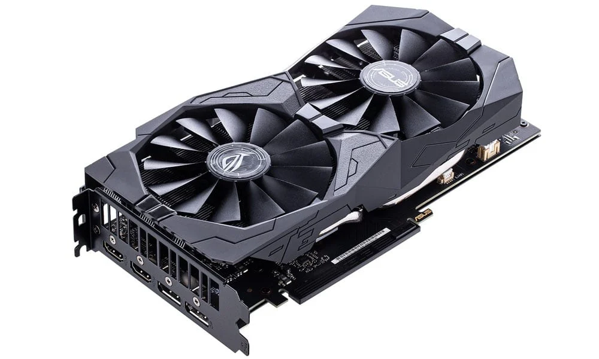
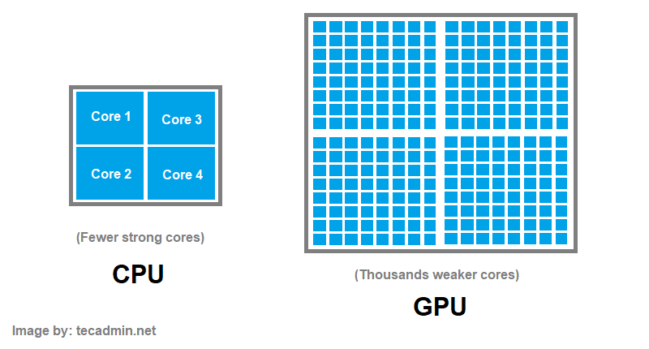
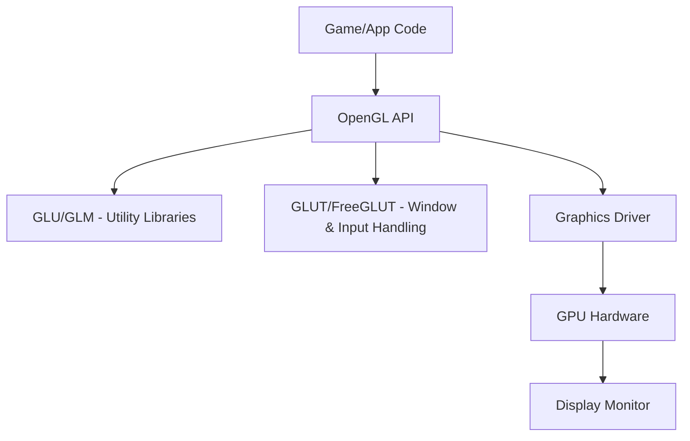
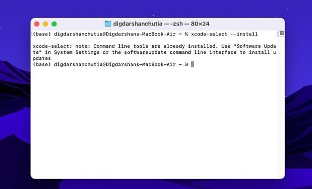
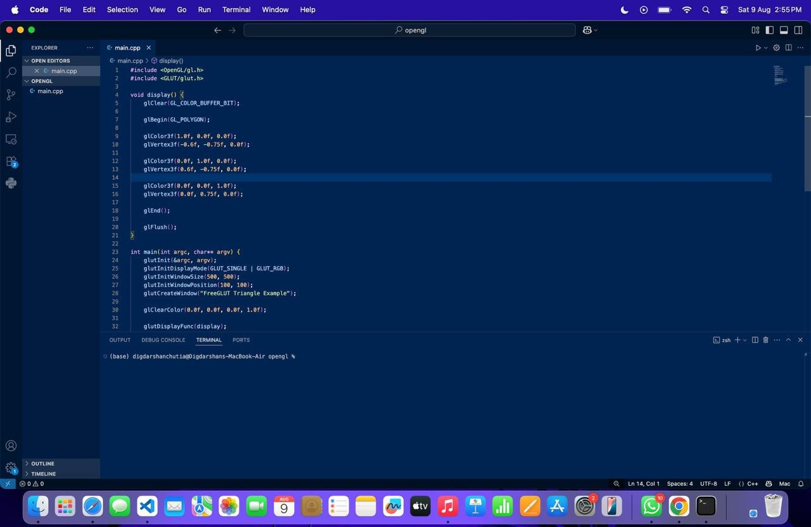
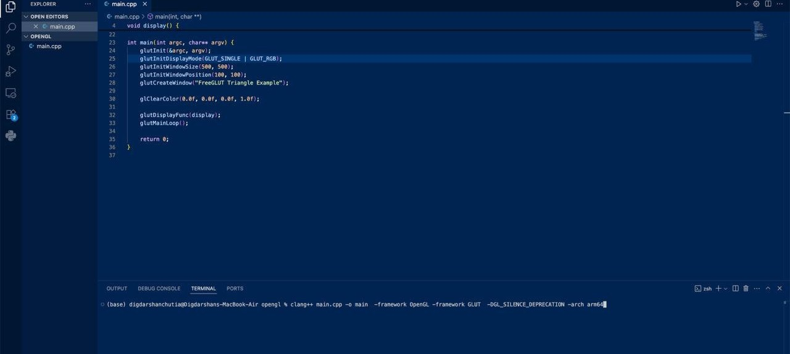
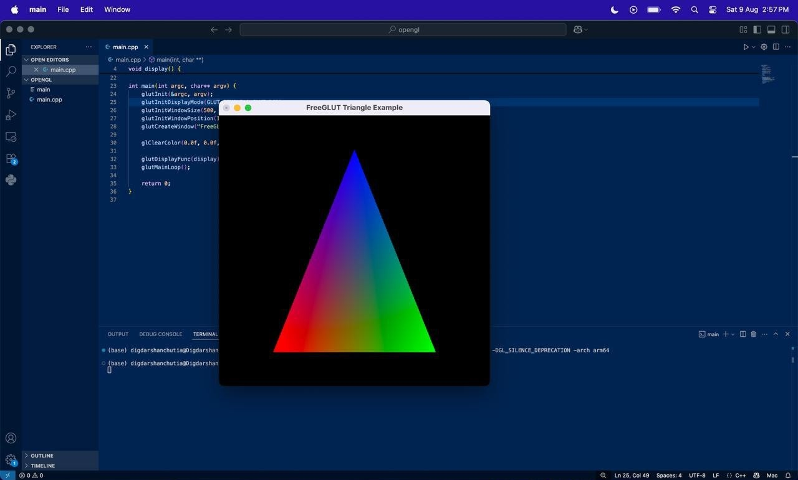
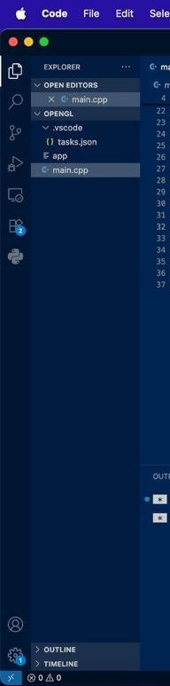

# Install and Setup OpenGL Developer Environment

> [Directly go to Installation](#installation-guide)
## What is OpenGL
Before we start the setup process and understand what OpenGL is and what the other components are that we need to start development using OpenGL:

So we all know about graphics cards or GPUs. All modern-day computers have a GPU. You may not have a big powerful NVIDIA or AMD GPU, but there is always a GPU, like an integrated GPU in the CPU.
Here is an image of a expensive dedicated GPU:


<div style="width: 60% ; overflow: hidden;">
  
</div>

Their main goal is to do calculations in parallel. As we know, we have a CPU that may have a few cores — say 6 — so it can run 6 tasks in parallel. You may say you can run more than 6 applications at a time, but they are not using the CPU at the same time. Your OS handles who gets to do their work when, and it’s pretty efficient at that. But tasks like 3D rendering, simulations, linear algebra calculations require many tasks to be solved in a small amount of time.

<div style="width: 80% ; overflow: hidden;">
  
</div>

Say you are running a game at 100 FPS — that means 100 frames to be rendered per second. That can't be done by a CPU in such a small amount of time. There comes the GPU — it can do thousands of simple calculations in parallel. So that's a brief about GPUs.

Now, say you want to make a game. First, you want to make a character — say Iron Man — and you want to use the GPU to render (draw on the screen) the character for you. So how will you use the GPU?

In the early days, people needed to write different code for different GPUs. You can think of this code as the ISA (assembly) of CPUs — they are different for different CPU architectures. Now, that is not good. So, Silicon Graphics — a company — came up with OpenGL, which abstracted the low-level stuff and gave a common interface or an API (you can think of it as a library like you import in C, like stdlib.h, and use functions like printf). These functions can just be called in our code, and the rest is handled by them.

So OpenGL provides us with such platform-independent functions which we can use to utilize the GPU and draw something on the screen, as it is a graphics library.



Now, OpenGL can just render things, but it needs a window (think of it as the portion of the screen where the application is shown) to render these pixels. Also, OpenGL does not manage inputs like mouse, keyboard, etc. So we need something else to manage this. There come these helper libraries (they are also a set of code written by someone to make our lives easier), like GLUT, FreeGLUT, etc.

GLUT is no longer supported and maintained, and it was proprietary software. So we can use FreeGLUT, which is its open-source alternative. Of course, there are lots of them out there.


#### Requirements 

- A Code Editor
    This is to write your code , you can use any like VS Code , CodeBlocks, Vim , Text Editor also :)
- OpenGL
    This is already installed in all computers ,This is the  OpenGL runtime — the driver and the actual GPU implementation of OpenGL
- OpenGL Development Headers & Libraries
    These are the header files .h that has the function declarations and all which you import in your code using #include , and their actual implementation is alreay done by the GPU providers or OS , but to access them we need a interface , that will be used by our code which are these libraries they are of different formats in different OS , .lib, .dll in WIndows , .so in Linux and .framework in MacOS
- FreeGLUT
    for creating windows and handling input as explained above
- GCC or any compiler like Clang etc.
    To Compile your written code to machine executable (.exe, .out etc)

These are all the components we need to start our development independent of our OS , but their installation process is different in different OS 

## Installation guide 

> [Go to Windows](#windows)

> [Go to MacOS](#macos)

### **Linux**

Here is a Video tutorial if you dont like to read.
Just copy the commands from below and paste them like i did , I had already installed them but if you have not installed them it will take some time for you.

<video controls width="100%" style="max-height: 500px;">
  <source src="../../assets/videos/linux-opengl-tut-cpy.mp4" type="video/mp4">
  Your browser does not support the video tag.
</video>

**1. Get any code editor you want or use any existing one.**

In Code::Blocks, the OpenGL Project template already sets up the libraries, so no extra linking flags are needed. This is a big advantage over VS Code. but i was only able to make it work for linux .

To use codeblocks:

- Open a Terminal
- Run `sudo apt install codeblocks`
- This will install the codeblocks ide
- Open it 

Congrats you have successfully installed Codeblocks

Or you can use VS Code if you already have it.. or Vim or Nodepad etc..

**2. Install Build Essentials (Compiler, Make, etc.)** 

Run `sudo apt install build-essential`

This installs:

- g++ (C++ compiler)
- make (optional but useful)
- libstdc++ and other development tools

**3. Install OpenGL + FreeGLUT Development Libraries**

Run `sudo apt install freeglut3-dev libglu1-mesa-dev libglew-dev libgl1-mesa-dev`

This installs:

- freeglut3-dev – FreeGLUT headers and linker files
- libglu1-mesa-dev – GLU (OpenGL Utility Library)
- libgl1-mesa-dev – Core OpenGL library (software renderer if no GPU driver)
- libglew-dev – (optional) for more modern OpenGL

Now you are good to go...

**4. How to write, compile and run the code**


Below is a example code

```cpp
#include <GL/freeglut.h>  // Use FreeGLUT header (cross-platform)

// Display callback function
void display() {
    glClear(GL_COLOR_BUFFER_BIT); // Clear the screen

    glBegin(GL_POLYGON); // Draw a triangle

    glColor3f(1.0f, 0.0f, 0.0f);  // Red
    glVertex3f(-0.6f, -0.75f, 0.0f);

    glColor3f(0.0f, 1.0f, 0.0f);  // Green
    glVertex3f(0.6f, -0.75f, 0.0f);

    glColor3f(0.0f, 0.0f, 1.0f);  // Blue
    glVertex3f(0.0f, 0.75f, 0.0f);

    glEnd();

    glFlush(); // Execute drawing commands
}

int main(int argc, char** argv) {
    glutInit(&argc, argv);                             // Initialize GLUT
    glutInitDisplayMode(GLUT_SINGLE | GLUT_RGB);       // Single buffer, RGB color
    glutInitWindowSize(500, 500);                      // Window size
    glutInitWindowPosition(100, 100);                  // Window position
    glutCreateWindow("FreeGLUT Triangle Example");     // Create window

    glClearColor(0.0f, 0.0f, 0.0f, 1.0f);               // Set background color to black

    glutDisplayFunc(display);                          // Register display callback
    glutMainLoop();                                    // Start the main loop

    return 0;
}

```

CodeBlocks: Its easiest here

- Open Codeblocks
- Go to File->New->Project
- Scroll and select OpenGL Project
- Follow the remaining steps
- Write your code
- To build/compile the code In toolbar press Build than again Build
- Than to run the code Go to Build->Run

VS Code: 

Here is a video tutorial of how to use VS Code after installing everything

<video controls width="100%" style="max-height: 500px;">
  <source src="../../assets/videos/opengl-in-vscode2.mp4" type="video/mp4">
  Your browser does not support the video tag.
</video>

- Open VS Code open a folder , create a c++ file
- Write your code
- Open terminal if not opened use Ctrl+` inside vs code
- make sure you are in the same path as the file
- Run `g++ filename.cpp -o outputname -lglut -lGLU -lGL`
- This will compile your code
- Now run `./outputname` to run the program

OR if you want to avoid typing the long command everytime you can just configure a tasks.json file

- Press `Ctrl+Shift+P` inside VS Code (or just create one FOlder name .vscode and a tasks.json file inside it)
- Search tasks.json 
- Open It
- Pate the following inside it

```js
{
  "version": "2.0.0",
  "tasks": [
    {
      "label": "Build OpenGL App",
      "type": "shell",
      "command": "g++",
      "args": [
        "${file}",                         
        "-o", "${fileBasenameNoExtension}", 

        // Linux
        "-lglut",
        "-lGLU",
        "-lGL"

        // --- macOS (uncomment if using system GLUT) ---
        // "-framework", "OpenGL",
        // "-framework", "GLUT"

        // --- Windows (uncomment if using MinGW or MSYS2) ---
        // "-lfreeglut",
        // "-lopengl32",
        // "-lglu32"
      ],
      "group": {
        "kind": "build",
        "isDefault": true
      },
      "problemMatcher": ["$gcc"],
      "detail": "Builds the current C++ OpenGL/FreeGLUT file"
    }
  ]
}

```
- Now to compile/build you can just enter `Ctrl+Shift+B`
- Than run the program by typing `./filename` in terminal

You successfully compiled and ran your first application using OpenGL


### **Windows**

Windows (MSYS2 and VS Code Method)

Here is a Video tutorial if you dont like to read, Some of the commands were little different in video , they are correct in this article now , so you can directly copy and paste them.

<video controls width="100%" style="max-height: 500px;">
  <source src="../../assets/videos/opengl-in-windows-vscode.mp4" type="video/mp4">
  Your browser does not support the video tag.
</video>

**Install MSYS2**

- Go to the official MSYS2 website: https://www.msys2.org/
- Download the installer.
- Run the installer and follow the setup as shown in the website.

At the end,type `pacman -Syu` in the terminal (automatically opened one). If it closes after updating, open the MSYS2 terminal again and continue.

**Install Compiler and Build Tools**

- Open the MSYS2 MINGW64 terminal and run:
```bash
pacman -S mingw-w64-x86_64-toolchain
```
- Slect the option 3 (gcc at the end)

This installs:

- g++ (C++ compiler)

**Install OpenGL + FreeGLUT Development Libraries**

In the same MINGW64 terminal, run:

```bash
pacman -S mingw-w64-x86_64-freeglut 
```

This installs:

- mingw-w64-x86_64-freeglut – FreeGLUT headers and libraries

**Add MinGW to your PATH**

- Find where MSYS2 is installed (default: C:\msys64)
- Copy the path to bin (default is `C:\msys64\mingw64\bin`)
- Add this to your Windows System Environment Variables
    - Open Searchbar and search for Environment Variables
    - Environment Varibles -> System Variables -> Path -> Edit
    - Add the path to the bin of mingw64 `C:\msys64\mingw64\bin`
    - Press Ok in all 3 windows

Now you can run g++ from any terminal (PowerShell, CMD, etc.), not just MSYS2.

**Write, Compile, and Run the Code**

Below is the same example code from Linux (works the same):

```cpp
#include <GL/freeglut.h>  // Use FreeGLUT header (cross-platform)

void display() {
    glClear(GL_COLOR_BUFFER_BIT);

    glBegin(GL_POLYGON);

    glColor3f(1.0f, 0.0f, 0.0f);
    glVertex3f(-0.6f, -0.75f, 0.0f);

    glColor3f(0.0f, 1.0f, 0.0f);
    glVertex3f(0.6f, -0.75f, 0.0f);

    glColor3f(0.0f, 0.0f, 1.0f);
    glVertex3f(0.0f, 0.75f, 0.0f);

    glEnd();

    glFlush();
}

int main(int argc, char** argv) {
    glutInit(&argc, argv);
    glutInitDisplayMode(GLUT_SINGLE | GLUT_RGB);
    glutInitWindowSize(500, 500);
    glutInitWindowPosition(100, 100);
    glutCreateWindow("FreeGLUT Triangle Example");

    glClearColor(0.0f, 0.0f, 0.0f, 1.0f);

    glutDisplayFunc(display);
    glutMainLoop();

    return 0;
}
```

VS Code :

- Open VS Code.
- Create a .cpp file in your workspace.
- Open a terminal in VS Code (Ctrl+`).
- Make sure you’re in the MSYS2 MINGW64 environment (you can launch VS Code from MINGW64 terminal using code . to ensure correct paths).

Compile using:

```bash
g++ filename.cpp -o outputname -lfreeglut -lopengl32 -lglu32
```

Run the program:
```bash
./outputname
```
IF you dont want to type the long command everytime to build you can configure it (kind of a shortcut)

- create a folder in the root named .vscode
- create a tasks.json inside the folder
- paste the below given lines in it
- After this is done you can compile/build the code using `Ctrl+Shift+B`
- After Compilation you can run the code in same way as before by running `./outputname` in the terminal

tasks.json for Windows (MSYS2)

```json
{
  "version": "2.0.0",
  "tasks": [
    {
      "label": "Build OpenGL App (Windows MSYS2)",
      "type": "shell",
      "command": "g++",
      "args": [
        "${file}",
        "-o", "${fileBasenameNoExtension}",
        "-lfreeglut",
        "-lopengl32",
        "-lglu32"
      ],
      "group": {
        "kind": "build",
        "isDefault": true
      },
      "problemMatcher": ["$gcc"],
      "detail": "Builds the current C++ OpenGL/FreeGLUT file for Windows MSYS2"
    }
  ]
}
```

#### **MacOS**

OpenGL Development Setup on macOS

**Install Requirements**

macOS already includes the OpenGL.framework and GLUT.framework as part of the system SDK — no extra libraries are needed.

However, you must have Apple’s compiler and headers installed via Xcode Command Line Tools.

**Install Xcode Command Line Tools**
In Terminal, run:

```bash
xcode-select --install
```
<div style="width: 60% ; overflow: hidden;">
  
</div>

Follow the prompts to download and install.
This gives you:

- clang++ compiler
- OpenGL and GLUT headers
- System SDK frameworks

**Create a Simple OpenGL Program**
Create a file main.cpp:

>for every program using opengl you need to add this libs for macos : `#include <OpenGL/gl.h> #include <GLUT/glut.h>`

Below is a test code you can copy

```cpp
#include <OpenGL/gl.h>
#include <GLUT/glut.h>

void display() {
    glClear(GL_COLOR_BUFFER_BIT);

    glBegin(GL_POLYGON);

    glColor3f(1.0f, 0.0f, 0.0f);
    glVertex3f(-0.6f, -0.75f, 0.0f);

    glColor3f(0.0f, 1.0f, 0.0f);
    glVertex3f(0.6f, -0.75f, 0.0f);

    glColor3f(0.0f, 0.0f, 1.0f);
    glVertex3f(0.0f, 0.75f, 0.0f);

    glEnd();

    glFlush();
}

int main(int argc, char** argv) {
    glutInit(&argc, argv);
    glutInitDisplayMode(GLUT_SINGLE | GLUT_RGB);
    glutInitWindowSize(500, 500);
    glutInitWindowPosition(100, 100);
    glutCreateWindow("FreeGLUT Triangle Example");

    glClearColor(0.0f, 0.0f, 0.0f, 1.0f);

    glutDisplayFunc(display);
    glutMainLoop();

    return 0;
}
```

<div style="width: 60% ; overflow: hidden;">
  
</div>


**Compile**

<div style="width: 60% ; overflow: hidden;">
  
</div>


For Apple Silicon M1,M2 etc (arm64): 

```bash
clang++ *.cpp -o app \
  -framework OpenGL -framework GLUT \
  -DGL_SILENCE_DEPRECATION -arch arm64
```

For Intel Macs (x86_64):

```bash
clang++ *.cpp -o app \
  -framework OpenGL -framework GLUT \
  -DGL_SILENCE_DEPRECATION -arch x86_64
```

**Run**

<div style="width: 60% ; overflow: hidden;">
  
</div>

```bash
./app

# replace with the name you had given
```

A 500×500 window should appear with a black background.

**VS Code Build Task (Optional)**

Create .vscode/tasks.json in your project folder:

<div style="width: 60% ; overflow: hidden;">
  
</div>

Paste the below given congig in it 

```json
{
    "version": "2.0.0",
    "tasks": [
        {
            "label": "Build OpenGL App",
            "type": "shell",
            "command": "clang++",
            "args": [
                "*.cpp",
                "-o", "app",
                "-framework", "OpenGL",
                "-framework", "GLUT",
                "-DGL_SILENCE_DEPRECATION",
                "-arch", "arm64"
            ],
            "options": {
                "cwd": "${workspaceFolder}"
            },
            "group": {
                "kind": "build",
                "isDefault": true
            },
            "problemMatcher": ["$gcc"]
        }
    ]
}
```

**Now press Cmd + Shift + B to build.**

Notes

- OpenGL and GLUT are deprecated in macOS but still work.
- -DGL_SILENCE_DEPRECATION removes deprecation warnings.
- No extra installs are needed beyond Xcode Command Line Tools.