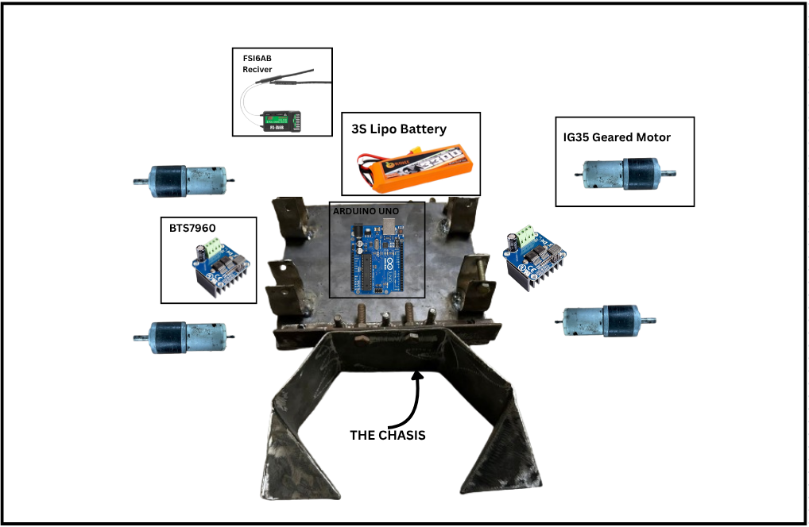
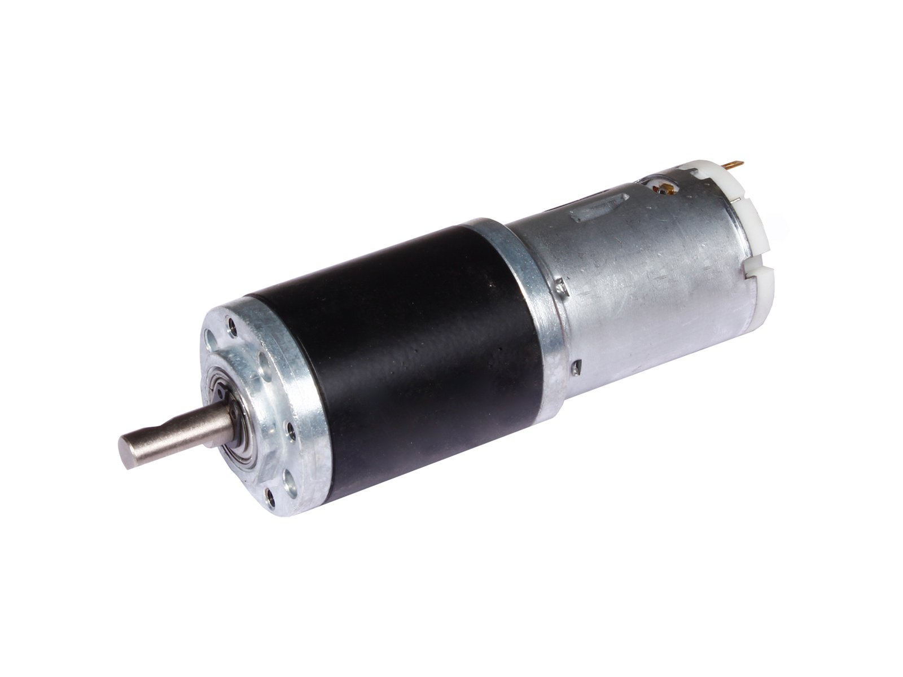
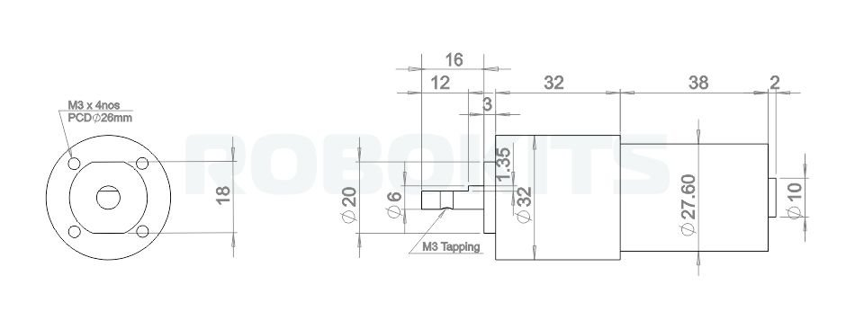

# The Robot

## **Introduction**

Here is a dissection of our bot showing all its key components:

The chassis is built out of mild steel, and the whole bot weighs around 5 kg with the battery included. Most competitions allow a weight limit of 5 kg, but some permit up to 7 kg — in such cases, we can add additional weights.

The key to building a good RoboSoccer bot is ensuring it's sturdy enough to withstand the beating from other heavy bots, while also having enough torque to push opponents. At the same time, it must be agile enough for precise control during fast-paced matches.

---

## **Components**

### **The Motor:**

These are the most critical components of the bot, so finding the right motor for our use case was a challenging task — especially since it was our first time working with such motors.

We did a bit of research on different motor types and their specifications. You can find a basic overview of motor fundamentals [here](../common/motors.md).

We eventually chose 12V 300 RPM planetary geared motors called **IG32** from Rhino Motors. These offered the best value and performance in our budget range.

This is an image of the motor we used:

Here are its dimensions:

And below are its detailed specifications:

| **Specification**           | **Details**                                              |
|----------------------------|-----------------------------------------------------------|
| **Type**                   | 12V DC Geared Motor with Metal Planetary Gearbox         |
| **Base Motor RPM**         | 18000 RPM                                                |
| **Output RPM**             | 300 RPM                                                  |
| **Gearbox Stages**         | 3-stage planetary                                        |
| **Rated Torque**           | 10 kg·cm                                                 |
| **Stall Torque**           | > 40 kg·cm (use at rated torque for longevity)           |
| **Shaft Type**             | D-type                                                   |
| **Shaft Diameter**         | 6 mm                                                     |
| **Shaft Length**           | 16 mm total (12 mm D-shaped)                             |
| **Shaft Thread**           | M3 threaded hole                                         |
| **Back Shaft Length**      | 9 mm                                                     |
| **Gearbox Diameter**       | 32 mm                                                    |
| **Motor Diameter**         | 28.5 mm                                                  |
| **Motor Length**           | 70 mm (without shaft)                                    |
| **Weight**                 | 300 g                                                    |
| **Supply Voltage**         | 12V DC                                                   |
| **No-load Current**        | 800 mA                                                   |
| **Load Current (Max)**     | Up to 7.5 A                                              |
| **Coupling Options**       | CNC coupling (6 mm) or fixed coupling                    |

You can buy these motors [here](https://robokits.co.in/motors/rhino-ig32-12v-20w-dc-motors/dc-geared-12v-motor/rhino-12v-dc-300rpm-10kgcm-ig32-heavy-duty-planetary-geared-motor?srsltid=AfmBOoqVHB813jvnOhRy1lyMDQRM1ZH16Mm-hzgd4kq7T1jpzu9Uoq_w)

