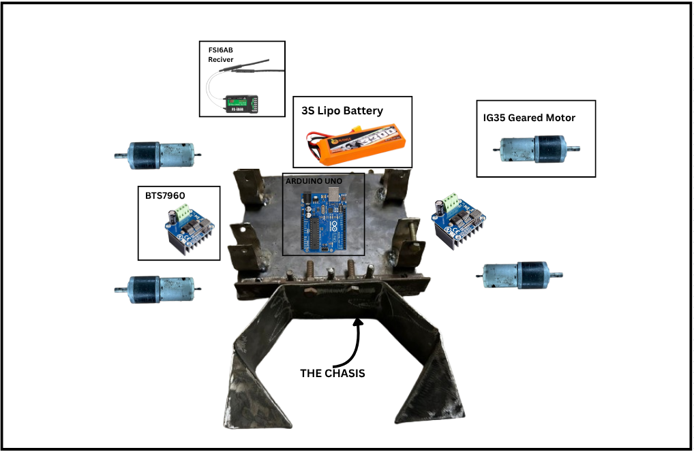
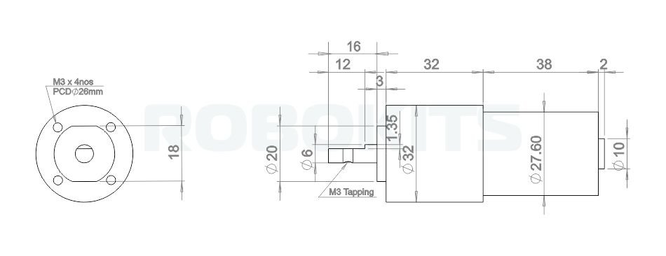
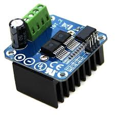
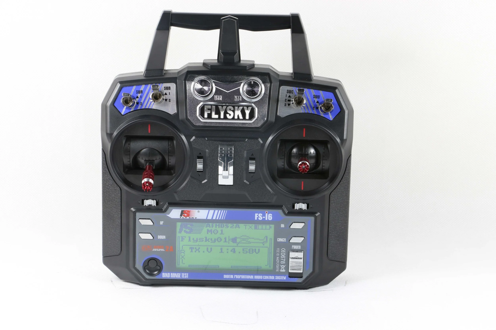
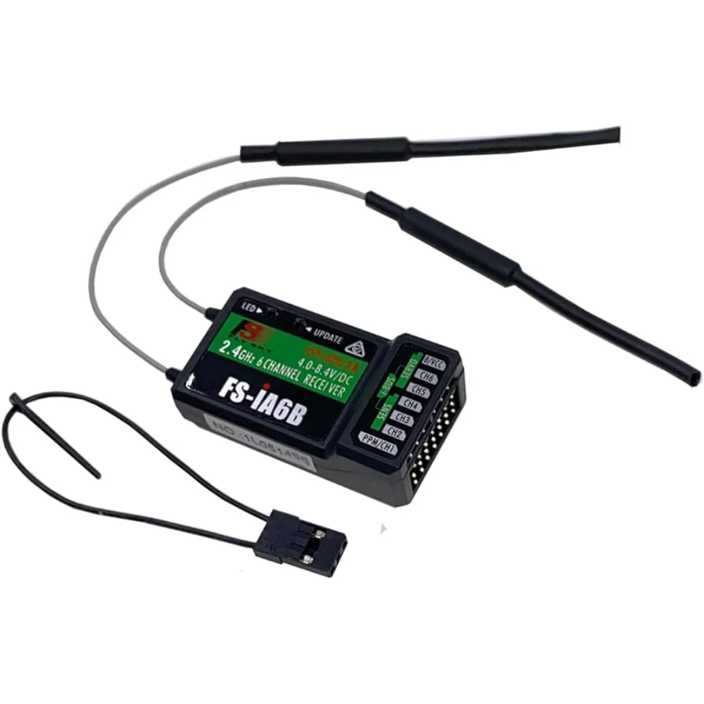
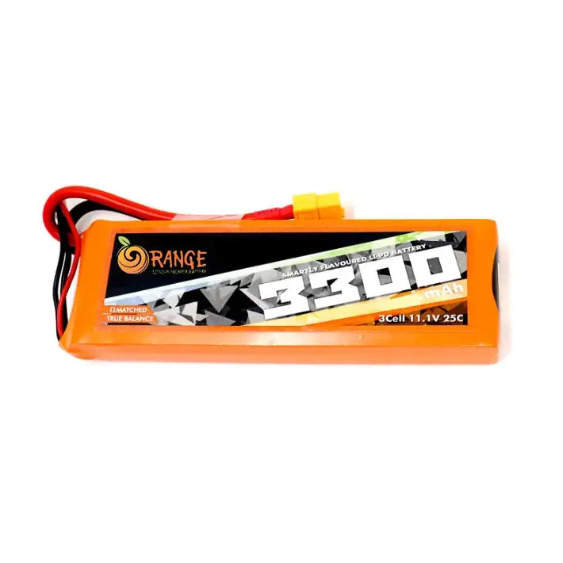
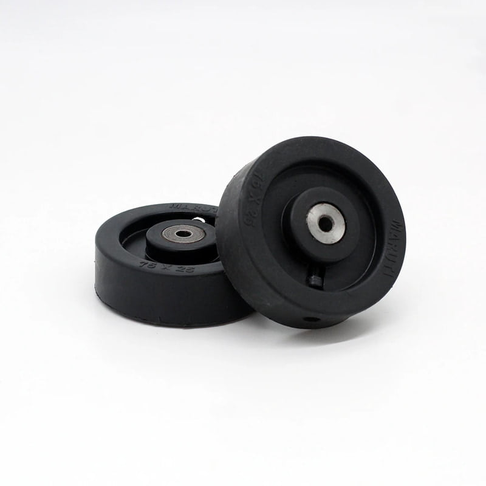

# The Robot

## **Introduction**

Here is a dissection of our bot showing all its key components:

The chassis is built out of mild steel, and the whole bot weighs around 5 kg with the battery included. Most competitions allow a weight limit of 5 kg, but some permit up to 7 kg — in such cases, we can add additional weights.

The key to building a good RoboSoccer bot is ensuring it's sturdy enough to withstand the beating from other heavy bots, while also having enough torque to push opponents. At the same time, it must be agile enough for precise control during fast-paced matches.

---

## **Components**

### **The Motor:**

These are the most critical components of the bot, so finding the right motor for our use case was a challenging task — especially since it was our first time working with such motors.

We did a bit of research on different motor types and their specifications. You can find a basic overview of motor fundamentals [here](../common/motors.md).

We eventually chose 12V 300 RPM planetary geared motors called **IG32** from Rhino Motors. These offered the best value and performance in our budget range.

This is an image of the motor we used:

Here are its dimensions:

And below are its detailed specifications:

| **Specification**           | **Details**                                              |
|----------------------------|-----------------------------------------------------------|
| **Type**                   | 12V DC Geared Motor with Metal Planetary Gearbox         |
| **Base Motor RPM**         | 18000 RPM                                                |
| **Output RPM**             | 300 RPM                                                  |
| **Gearbox Stages**         | 3-stage planetary                                        |
| **Rated Torque**           | 10 kg·cm                                                 |
| **Stall Torque**           | > 40 kg·cm (use at rated torque for longevity)           |
| **Shaft Type**             | D-type                                                   |
| **Shaft Diameter**         | 6 mm                                                     |
| **Shaft Length**           | 16 mm total (12 mm D-shaped)                             |
| **Shaft Thread**           | M3 threaded hole                                         |
| **Back Shaft Length**      | 9 mm                                                     |
| **Gearbox Diameter**       | 32 mm                                                    |
| **Motor Diameter**         | 28.5 mm                                                  |
| **Motor Length**           | 70 mm (without shaft)                                    |
| **Weight**                 | 300 g                                                    |
| **Supply Voltage**         | 12V DC                                                   |
| **No-load Current**        | 800 mA                                                   |
| **Load Current (Max)**     | Up to 7.5 A                                              |
| **Coupling Options**       | CNC coupling (6 mm) or fixed coupling                    |

You can buy these motors [here](https://robokits.co.in/motors/rhino-ig32-12v-20w-dc-motors/dc-geared-12v-motor/rhino-12v-dc-300rpm-10kgcm-ig32-heavy-duty-planetary-geared-motor?srsltid=AfmBOoqVHB813jvnOhRy1lyMDQRM1ZH16Mm-hzgd4kq7T1jpzu9Uoq_w)

### **The Motor Driver:**

These are the controller of the motors , The arduino will give commands to the motors how to run by changing the potential difference accross the motor terminals but the motor works at 12V and the Arduino can only deliver 5V at max also the Arduino is not capable of providing the current the motor draws , so here the motor driver comes , It takes the 12V input directly from a battery and than takes 0V-5V commands from the Arduino and depending upon the Arduino commands it passes down the 12V voltage to the Motor terminals , also it can reverse the polarity of output voltage to get a reverse spin of the motors. There are several types of motor drivers available , you can learn more about motor drivers and their workings [here](). 

We considered the motor requirements and the battery and choose the BTS7960 Motor driver. They are cheap , have high current rating and was a good match for us. We recived a damaged driver that wasted a lot of our time so , always check them one by one directly first.

Here is a image of our driver:

Here is its datasheet: 

And below are its detailed specifications:

| Specification            | Value        |
|---------------------------|--------------|
| Voltage Rating (V)        | 6 to 27 VDC  |
| Current Rating (A)        | 43           |
| Max. Current (A)          | 43           |
| Logic Voltage (V)         | 3.3 – 5      |
| Duty Cycle                | 0 – 100%     |
| Path Resistance (Ω)       | 16 mΩ at 25°C|
| Quiescent Current (µA)    | 7 µA at 25°C |
| Pulse Frequency (kHz)     | 25           |
| Dimensions (mm) (L×W×H)   | 50 × 50 × 43 |
| Weight (g)                | 67           |
| Shipping Weight (kg)      | 0.07         |
| Shipping Dimensions (cm)  | 6 × 6 × 4    |

You can buy it from : [Robu](https://robu.in/product/double-bts7960-43a-h-bridge-high-power-stepper-motor-driver-module/) , [Robokits](https://robokits.co.in/motor-drives-drivers/dc-motor-driver/bts7960-high-power-driver-module-43a?gad_source=1&gad_campaignid=251214656&gbraid=0AAAAAD9MgRAsDUQzyK9RjZGEznRMYYTGs&gclid=Cj0KCQjwrJTGBhCbARIsANFBfgsUOFowVdLSvFYgRhsJy5oZa4ZkPnWmv-KopDraLBZ8RiHVFg5lDhEaAn-XEALw_wcB) or any other place you like.

### **The Microcontroller:**

We used a Arduino UNO R3 , It contains a ATmega328P Processor , Its task in our bot is just to recive the pwm signals from the reciver and forward it to the motor driver. I will not explain it here since it has a very good docs that you can find [here](https://docs.arduino.cc/hardware/uno-rev3/)

### **The Transmitter and Receiver:**

To control the bot wirelessly, we used the FlySky FS-i6 Transmitter paired with the FS-iA6B Receiver.  

#### **Why are they needed?**  
In RoboSoccer, we need to control the bot’s movement in real time.  
The transmitter (remote) sends commands from the operator’s hands, while the receiver (on the bot) captures these commands and forwards them as PWM signals to the Arduino.  

#### **How do they work?**  
- The FlySky FS-i6 transmitter converts stick movements (throttle, steering, etc.) into digital signals and broadcasts them over the 2.4 GHz band.  
- The FS-iA6B receiver, mounted on the bot, listens to this signal and outputs PWM (Pulse Width Modulation) signals for each channel.  
- The Arduino reads these PWM signals and translates them into motor driver commands, which control the speed and direction of the motors.  

This setup enables our bot to move

---

#### **FlySky FS-i6 Transmitter:**

| Specification            | Details                                |
|---------------------------|----------------------------------------|
| Channels                  | 6                                      |
| Frequency Range           | 2.405 – 2.475 GHz (AFHDS 2A protocol) |
| Bandwidth                 | 500 kHz                               |
| Transmission Power        | ≤ 20 dBm                              |
| Modulation                | GFSK                                  |
| Control Distance          | Up to ~500 m (open ground)            |
| Power Supply              | 4 × AA batteries                      |
| Display                   | Backlit monochrome LCD                |
| Dimensions (mm)           | 174 × 89 × 190                        |
| Weight                    | ~392 g                                |

---

#### **FlySky FS-iA6B Receiver:**

| Specification            | Details                                |
|---------------------------|----------------------------------------|
| Channels                  | 6                                      |
| Protocol                  | AFHDS 2A                               |
| Frequency Range           | 2.405 – 2.475 GHz                     |
| Power Supply              | 4.0 – 6.5 V DC                        |
| Current Consumption       | 30 mA @ 5 V                           |
| Output Signal             | PWM / i-BUS / PPM                     |
| Range                     | Up to ~500 m (line of sight)          |
| Dimensions (mm)           | 47 × 26.2 × 15                        |
| Weight                    | ~14 g                                 |
| Antenna                   | Dual antenna (for stable signal)      |

---

We connected the receiver channels to the Arduino UNO, which then maps the PWM signals to motor control commands.  
This enables us to control both speed and direction of the bot during RoboSoccer matches.

We are very grateful of Dr. Durlov Sonowal Sir who provided us this pair to use.

You can buy it from any online site or offline store.

### **The Battery:**

To power our bot, we used a 3S LiPo (Lithium Polymer) battery with a 3300 mAh capacity.  

#### **Why a LiPo Battery?**
- High Discharge Capability: LiPos deliver large bursts of current instantly, which is essential when the motors need sudden torque.  
- Lightweight & Compact: Higher energy density than NiMH or Li-ion, helping us stay within the 5 kg bot weight limit.  
- Stable Voltage: A 3S pack provides a nominal **11.1 V**, which matches with our motor driver and motors.  

---

#### **Pro-Range / Orange 3S 3300 mAh LiPo Specifications:**

| Specification             | Details                       |
|----------------------------|-------------------------------|
| Nominal Voltage (V)        | 11.1                          |
| Nominal Capacity (mAh)     | 3300                          |
| Battery Cell Composition   | 3S (3 cells in series)        |
| Discharge Rate (C Rating)  | 25C continuous / 60C burst    |
| Max Continuous Current (A) | 82.5 A (3300 × 25 ÷ 1000)     |
| Max Burst Current (A)      | 198 A (3300 × 60 ÷ 1000)      |
| Output Connector           | XT-60                         |
| Balance Connector          | JST-XH                        |
| Length (mm)                | 136                           |
| Width (mm)                 | 43                            |
| Height (mm)                | 20                            |
| Weight (g)                 | 260                           |
| Shipping Weight (kg)       | 0.08                          |
| Shipping Dimensions (cm)   | 17 × 6 × 4                    |

---

*Note:* You will also need a charger to charge the Lipo battery , We use [this](https://robu.in/product/isdt-pd60-60w-6a-portable-1-4s-li-po-balance-charger/) charger from  ISDT , It works good.

Here is an image of the battery we used:

You can buy it from [robu](https://robu.in/product/orange-3300mah-3s-35c-80c-lithium-polymer-battery-pack-lipo/) or any other place.

### **The Wheels:**

They are one of the most important parts of your bot , but we ignored them till the end and that caused us many problems. At first we used some plastic wheels bought from a local offline store from guwahati and they broke during a game so choose your wheels wisely. They need to be sturdy so they can take the beating also they need to match with the size of your frame so it can lift your bot from ground properly. I suggest buying them from a site named [Technobotix](https://www.technobotix.in/?srsltid=AfmBOoovUAhRCT18KnV9FKXUE28vRP5kmKm9XTJpseAPGTR4oj8ERJ61) , They make best wheels for Robosoccer, Robosumo and Robowar bots. 

The wheels we used are these :

You can buy them from [here](https://www.technobotix.in/products/generic-polypropylene-wheel-including-hub-3-x-1-in-black-76-2-x-25-4-mm-/1781252000000067773)
