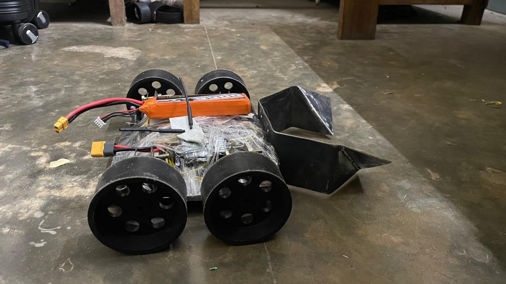
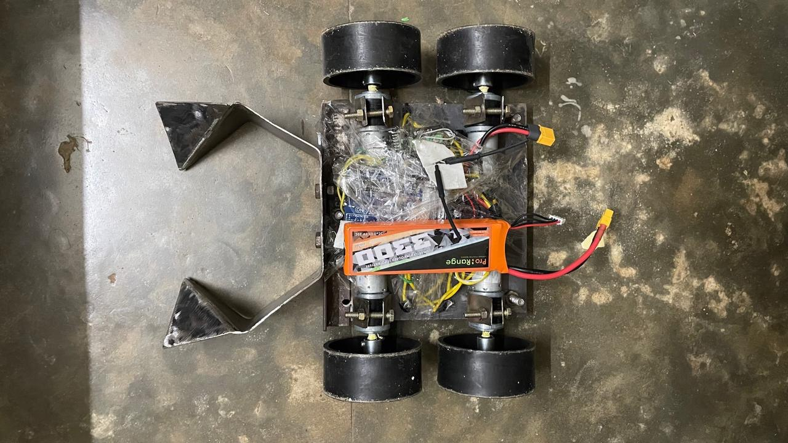
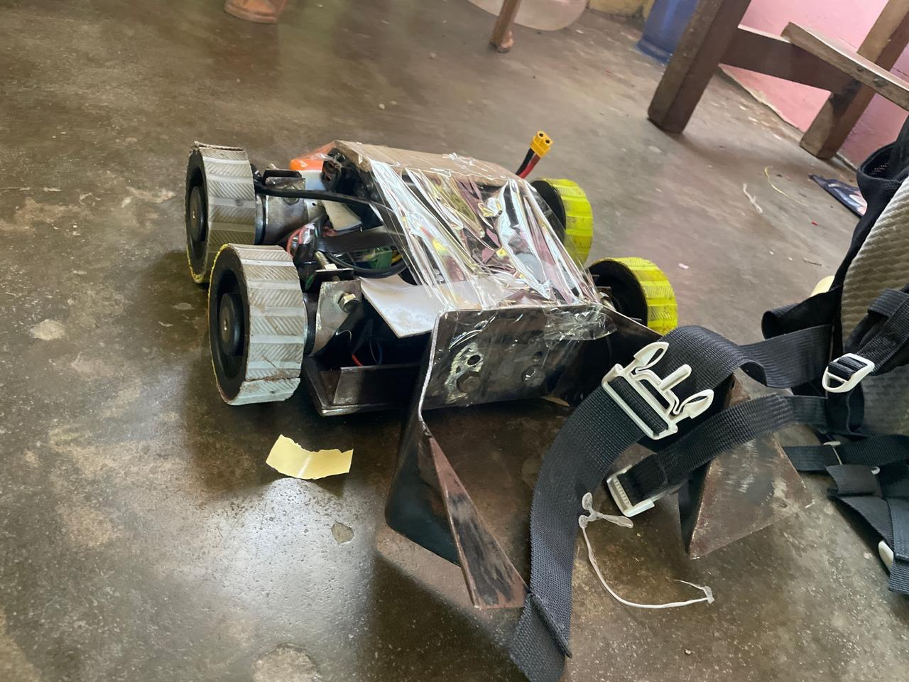
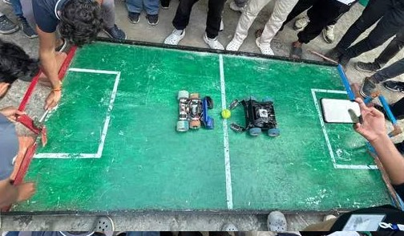

# Robosoccer Overview

Our first robotics project was our robosoccer bot
It's not a human like robot playing soccer with its robotic legs , its a simple RC controlled four wheeled bot (you can say its a car) that pushes the ball to the goal, and it's mostly a 1v1 match.

## **The Bot**
Here is our first build , it looks good according to me , but it broke during its first fight :(

  
  
  
  

Here is our v2 , I do not have a good click of it , it does not looks better than v1, but it was able to score some goals and lasted till the end , it was a good improvement !

  
  

Here are some images of bots of other teams , which are way better than us and has way more expeience than us 

  

more about the bot in next pages...
---

## **The Arena**

This is how a arena looks like , Its about (2.5m x 2m) 

  

---

## **The Game**

The objective of the game is same as normal football , to score goals , the team that scores the most goals wins the match 

Here is a clip from one of our game , as you can see its more like sumo than football 
<video controls width="100%" style="max-height: 500px;">
  <source src="../assets/videos/robosoccer-jec-game-demo.mp4" type="video/mp4">
  Your browser does not support the video tag.
</video>

Here are links to way more better games than our ones :

[Game 1](https://www.youtube.com/watch?v=LaOmCM-d4z0)
[Game 2](https://www.youtube.com/watch?v=heDUn-9a-r0)
[Game 3](https://www.youtube.com/watch?v=lur5Ze4Kxl4)

